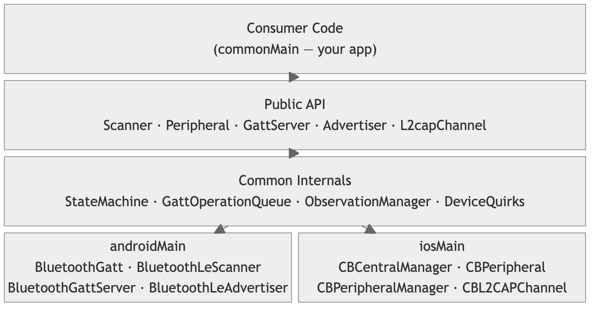

# kmp-ble Architecture

This document explains the key design decisions and internal structure of kmp-ble. It's intended for contributors and anyone curious about how the library works under the hood.

---

## Overview

kmp-ble is a Kotlin Multiplatform BLE library targeting Android and iOS. The core design principle is: **shared logic in `commonMain`, platform bridges in `expect/actual`, no platform details leaking into the public API.**



---

## State Machine

The connection state machine is the core of the library. It tracks every peripheral through 14 states with an exhaustive transition table.

### States

```
State
├── Connecting
│   ├── Transport          — Physical link establishing
│   ├── Authenticating     — Bonding/pairing in progress
│   ├── Discovering        — GATT service discovery
│   └── Configuring        — MTU negotiation, CCCD setup
├── Connected
│   ├── Ready              — Normal operation
│   ├── BondingChange      — Bond state changed mid-connection
│   └── ServiceChanged     — Service list changed, rediscovering
├── Disconnecting
│   ├── Requested          — Local disconnect initiated
│   └── Error              — Connection lost during operation
└── Disconnected
    ├── ByRequest          — Clean local disconnect completed
    ├── ByRemote           — Remote device disconnected
    ├── ByError(error)     — Connection error with details
    ├── ByTimeout          — Supervision timeout
    └── BySystemEvent      — Adapter off, airplane mode
```

### Transition Table

The state machine uses a **declarative transition table** — a `Map` from `(State, Event)` pairs to transition functions. Two resolution mechanisms:

1. **Wildcard transitions** (checked first): `AdapterOff` and `RemoteDisconnected` can fire from any non-Disconnected state, always winning over specific transitions.

2. **Hierarchy-aware lookup**: If no exact match for `(Disconnected.ByError, SomeEvent)`, the resolver walks up to `(Disconnected, SomeEvent)`, then `(State, SomeEvent)`. This avoids duplicating transitions for every Disconnected subtype.

Illegal transitions throw `IllegalStateException` — caught in tests, never silent in production.

### Why 14 States?

Other libraries (including Kable) use ~5 states: Disconnected, Connecting, Connected, Disconnecting, Cancelling. This makes it impossible to distinguish:

- "Connection failed because bonding was rejected" vs "connection lost during service discovery"
- "User disconnected" vs "device disconnected" vs "Bluetooth was turned off"
- "Services changed and we're rediscovering" vs "we lost the connection"

Each state in kmp-ble represents a distinct situation that may require different handling by the consumer. `Disconnected.ByError(error)` carries the actual error; `Connected.ServiceChanged` tells the consumer their cached service references are stale.

---

## Concurrency Model

### The Problem

Android's `BluetoothGatt` is not thread-safe. Calling `writeCharacteristic()` while `readCharacteristic()` is in-flight silently fails. iOS's CoreBluetooth delivers delegate callbacks on whichever dispatch queue you provide. Both platforms need careful serialization.

### Two-Layer Architecture

```
Layer 1: Platform callbacks (OS-managed)
    ↓  CompletableDeferred / Channel
Layer 2: Serialized processing (commonMain)
    ↓  suspend/resume
Layer 3: Consumer API (caller's coroutine context)
```

**Layer 2** uses `Dispatchers.Default.limitedParallelism(1)` — a serial execution view that works on all KMP targets without `expect/actual`. At most one coroutine runs at a time per peripheral. No locks, no mutexes.

**Layer 1** is platform-specific:
- **Android**: `HandlerThread` receives `BluetoothGattCallback` callbacks, completes `CompletableDeferred` values
- **iOS**: Serial `DispatchQueue` receives `CBPeripheralDelegate` callbacks

**Each peripheral has its own serialized dispatcher.** Writing to Device A never stalls reads from Device B.

### Why Not a Single Thread Per Peripheral?

The original design tried `newSingleThreadContext()` per peripheral, but:
- `newSingleThreadContext` is JVM-only
- `Handler.asCoroutineDispatcher()` isn't `CloseableCoroutineDispatcher` on Android
- There's no `DispatchQueue.asCoroutineDispatcher()` in kotlinx-coroutines for Native

`limitedParallelism(1)` compiles everywhere, provides the same serial guarantee, and doesn't allocate a real thread.

---

## GATT Operation Queue

Android allows only one GATT operation at a time. The queue serializes all operations with timeout protection.

### Design

```kotlin
// Simplified
internal class GattOperationQueue {
    private val channel = Channel<QueueEntry>(Channel.UNLIMITED)

    suspend fun <T> enqueue(timeout: Duration = 10.seconds, block: suspend () -> T): T {
        val deferred = CompletableDeferred<T>()
        channel.send(QueueEntry(block, deferred))
        return withTimeout(timeout) { deferred.await() }
    }
}
```

A drain job consumes entries one at a time. Each entry's `block` runs, the result completes the deferred, and the next entry starts.

### Key Behaviors

- **10-second timeout** per operation — Android will silently drop operations without a callback. The watchdog catches these.
- **Drain on disconnect** — all pending operations complete with `NotConnectedException`.
- **Cancellation** — cancelling the caller's coroutine cancels the *wait*, not the hardware operation. The in-flight GATT op completes silently, the result is discarded, and the queue advances. This prevents leaving the GATT in an inconsistent state.

---

## Observation Resilience

`observe()` and `observeValues()` Flows survive disconnects and auto-resubscribe on reconnect.

### How It Works

1. **On subscribe**: `ObservationManager` creates a tracked observation keyed by `(serviceUuid, characteristicUuid)` — UUID-based, not object-reference-based. A `MutableSharedFlow` is returned to the consumer.

2. **On disconnect**: All tracked observations receive an `Observation.Disconnected` event. Observations are **not cleared** — they remain tracked.

3. **On reconnect**: `ObservationManager.getObservationsToResubscribe()` returns all tracked observations. The peripheral re-enables CCCD (Client Characteristic Configuration Descriptor) for each one using the *new* native characteristic objects from the fresh GATT session.

4. **On permanent disconnect** (reconnection strategy exhausted): `Observation.PermanentlyDisconnected` is emitted. Observations are cleared. Flows complete.

### Two Consumer APIs

- **`observe()`** — emits `Observation` sealed type: `Value(data)` during connection, `Disconnected` during gaps. Consumer handles both.
- **`observeValues()`** — emits raw `ByteArray`. Suspends during disconnection gaps, transparently resumes on reconnect. Consumer doesn't see disconnects.

### Thread Safety

- Subscribe/unsubscribe operations are guarded by a `Mutex`
- The observation map is snapshotted to a `@Volatile` immutable copy for lock-free reads from platform callback threads
- `MutableSharedFlow.tryEmit()` is inherently thread-safe

---

## Error Model

Errors use **sealed interfaces** for composability. A single error can implement multiple interfaces:

```
BleError
├── ConnectionError
│   ├── ConnectionFailed(reason, platformCode?)
│   └── ConnectionLost(reason, platformCode?)
├── GattOperationError
│   ├── GattError(operation, status: GattStatus)
│   ├── AuthenticationFailed — also implements AuthError
│   └── EncryptionFailed    — also implements AuthError
├── AuthError (composable interface)
├── OperationConstraintError
│   └── MtuExceeded(attempted, maximum)
└── OperationFailed(message)
```

`AuthenticationFailed` is both a `GattOperationError` and an `AuthError`. Consumers can `when`-branch on whichever facet they care about:

```kotlin
when (error) {
    is AuthError -> promptUserToRePair()
    is GattOperationError -> retryOperation()
    // ...
}
```

`GattStatus` normalizes platform error codes into a common enum (e.g., `InsufficientAuthentication`, `ReadNotPermitted`). Unknown codes are preserved as `Unknown(platformCode, platformName)`.

---

## Device Quirk Registry

Android OEMs ship BLE stacks with device-specific bugs. The quirk registry applies workarounds automatically.

### Matching Priority

1. `manufacturer:model:display` — exact firmware match
2. `manufacturer:model` — any firmware
3. `manufacturer:model-prefix` — 6-char prefix for device series (e.g., all Pixel 7 variants)
4. `manufacturer` — any model from that OEM

### Active Quirks

| Quirk | Affected Devices | What It Does |
|-------|-----------------|--------------|
| Bond before connect | Samsung S21/S20/S10, Galaxy A52/A53 | Calls `createBond()` before `connectGatt()` |
| GATT retry delay | Google (1s), Pixel 6-8 (1.5s), Samsung (500ms) | Delay between GATT connection retries |
| GATT retry count | Google/Pixel (3), Samsung/Xiaomi/OnePlus (2) | Max retry attempts on GATT error 133 |
| Refresh services on bond | OnePlus, Xiaomi, Redmi, Poco, Oppo | Force service rediscovery after bonding completes |
| Bond state timeout | Xiaomi/Redmi/Poco (15s), Huawei/Honor (10s) | Extended timeout for slow bond callbacks |
| Connection timeout | Samsung (30s), Huawei/Honor (35s) | Extended timeout for slow connections |

The registry is internal — consumers don't interact with it. Adding entries is the easiest way to contribute (see [CONTRIBUTING.md](CONTRIBUTING.md)).

---

## GATT Server

The server module lets the phone act as a BLE peripheral — advertising and serving GATT characteristics.

### Architecture

`GattServer` and `Advertiser` are independent. You can:
- Advertise without a server (beacon use case)
- Run a server without advertising (connected-only)
- Use both together (typical peripheral role)

### Builder DSL

```kotlin
val server = GattServer {
    service("180A") {
        characteristic("2A29") {
            properties { read = true }
            permissions { read = true }
            onRead { device -> "MyDevice".encodeToByteArray().toBleData() }
        }
        characteristic("2A00") {
            properties { write = true; notify = true }
            permissions { write = true }
            onWrite { device, data, responseNeeded -> GattStatus.Success }
        }
    }
}
```

The builder validates at construction time: duplicate UUIDs are rejected, read-enabled characteristics must have `onRead` handlers, write-enabled characteristics must have `onWrite` handlers.

### Platform Mapping

| Common | Android | iOS |
|--------|---------|-----|
| `GattServer` | `BluetoothGattServer` | `CBPeripheralManager` |
| `Advertiser` | `BluetoothLeAdvertiser` | `CBPeripheralManager` |
| `server.open()` | `openGattServer()` + `addService()` | `add(service)` |
| `server.notify()` | `notifyCharacteristicChanged()` | `updateValue()` |

---

## L2CAP Channels

L2CAP Connection-Oriented Channels bypass GATT for high-throughput streaming (firmware updates, bulk data).

```kotlin
interface L2capChannel : AutoCloseable {
    val mtu: Int
    val psm: Int
    val isOpen: Boolean
    val incoming: Flow<ByteArray>
    suspend fun write(data: ByteArray)
}
```

L2CAP channels are independent of the GATT queue — they're a separate transport with their own read/write coroutines.

| Platform | Implementation |
|----------|---------------|
| Android | `BluetoothDevice.createL2capChannel(psm)` → `BluetoothSocket` with streams |
| iOS | `CBPeripheral.openL2CAPChannel(PSM:)` → `CBL2CAPChannel` (iOS 11+) |

---

## Testing Infrastructure

Every major component has a Fake* counterpart for unit testing without hardware:

| Real | Fake | Purpose |
|------|------|---------|
| Platform Peripheral | `FakePeripheral` | Simulate connections, GATT ops, observations, reconnections |
| Platform Scanner | `FakeScanner` | Emit pre-configured advertisements |
| Platform GattServer | `FakeGattServer` | Simulate server operations |
| Platform Advertiser | `FakeAdvertiser` | Simulate advertising lifecycle |
| Platform L2capChannel | `FakeL2capChannel` | Simulate streaming |

`FakePeripheral` supports the full observation resilience lifecycle:
- `simulateDisconnect()` — emits `Observation.Disconnected` without clearing observations
- `simulateReconnect()` — transitions through connect states, re-enables CCCD
- `simulatePermanentDisconnect()` — clears observations, completes Flows
- `emitObservationValue()` — simulate characteristic notifications

---

## Scanner

`Scanner.advertisements` is a **cold Flow**. Creating a `Scanner` starts nothing — no OS resources, no scanning. Scanning starts on first `collect()`, stops when the collector's coroutine is cancelled.

Multiple concurrent collectors share one underlying OS scan. This is standard structured concurrency — no `scanner.stop()` needed.

### Filters

Filters use an **OR-of-ANDs** model:

```kotlin
Scanner {
    filters {
        match { name("HeartSensor"); serviceUuid("180d") }  // AND
        match { manufacturerData(companyId = 0x004C) }       // OR
    }
}
```

Some filters are OS-level (hardware-offloaded, power-efficient), others are post-filters applied in the library:

| Filter | Android | iOS |
|--------|---------|-----|
| Service UUID | OS-level | OS-level |
| Name | OS-level | Post-filter |
| Manufacturer data | OS-level | Post-filter |
| Service data | OS-level | Post-filter |
| RSSI threshold | Post-filter | Post-filter |

### Emission Policy

- **`All`** — every advertisement packet (for RSSI tracking, indoor positioning)
- **`FirstThenChanges(rssiThreshold)`** — deduplicate by device identifier, re-emit on data or RSSI change. Default. Prevents 200+ emissions/sec from 20 devices advertising at 100ms.

---

## Platform Bridge Pattern

The `expect/actual` boundary is kept minimal. Platform code does two things:

1. **Receive OS callbacks** on a platform-appropriate thread/queue
2. **Complete `CompletableDeferred` values** to bridge into the common coroutine layer

Everything else — state transitions, queue management, observation tracking, error normalization — lives in `commonMain`.

```
Android: BluetoothGattCallback.onCharacteristicRead()
    → pendingRead.complete(GattResult(value, status))
        → GattOperationQueue resumes the suspended caller
            → StateMachine processes the result

iOS: CBPeripheralDelegate.peripheral(_:didUpdateValueFor:error:)
    → pendingRead.complete(GattResult(value, error))
        → (same common path)
```

---

## Key Design Decisions

| Decision | Rationale |
|----------|-----------|
| `limitedParallelism(1)` over dedicated threads | Compiles on all KMP targets. No thread lifecycle management. Same serial guarantee. |
| Sealed interfaces over sealed classes for errors | Composability — `AuthenticationFailed` is both `GattOperationError` and `AuthError` |
| UUID-based observation tracking over object reference | After reconnect, native characteristic objects are new. UUID is the stable identity. |
| Cold Flows over hot streams for scanning | No OS resources until collection starts. Structured concurrency handles cleanup. |
| 10s GATT operation timeout | Android silently drops operations. The watchdog prevents indefinite hangs. |
| `@Volatile` snapshot for observation map | Lock-free reads from platform callback threads. Mutex only on subscribe/unsubscribe. |
| Device quirks as internal registry | Consumers shouldn't need to know about Samsung BLE bugs. Workarounds apply automatically. |
| Independent GattServer and Advertiser | Beacon (advertise-only) and connected-only (server-only) are both valid use cases. |
