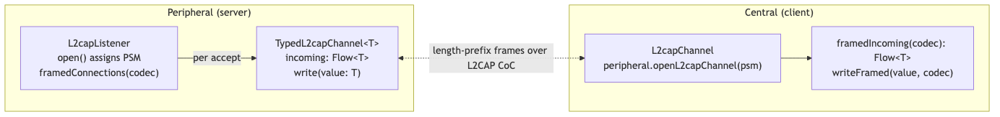

# HOWTO: Typed L2CAP Streams

End-to-end recipe for streaming typed values over an L2CAP CoC. Pairs a peripheral that emits a `Flow<T>` with a central that receives `Flow<T>`, with framing on the wire so the OS is free to coalesce or split chunks.

The components used here are all optional modules: `kmp-ble` for L2CAP transport, `kmp-ble-codec` for typed read/write and framing, and `kmp-ble-codec-serialization` if you want CBOR via `kotlinx-serialization`. For an in-tree example, see the `SensorReading` stream in `sample`.

---

## What you build



Each accepted connection is its own `TypedL2capChannel<T>` carrying a typed inbound `Flow<T>` and a typed outbound `write(value: T)`. Per-channel unframer state is isolated so partial frames on one client never bleed into another's decoding.

---

## 1. Define your payload

Any type works as long as you have a `BleCodec<T>`. The fastest path is `@Serializable` + CBOR:

```kotlin
import kotlinx.serialization.Serializable

@Serializable
data class SensorReading(
    val timestampMs: Long,
    val celsius: Double,
)
```

Apply the `org.jetbrains.kotlin.plugin.serialization` Gradle plugin in the module that declares the type. Without it, `@Serializable` is silently a no-op and the CBOR codec fails to find a `KSerializer` at runtime.

---

## 2. Build a codec

```kotlin
import com.atruedev.kmpble.codec.serialization.cborCodec

val SensorReadingCodec = cborCodec<SensorReading>()
```

`cborCodec<T>` is a reified factory that picks up the generated `KSerializer<T>` and wraps it in a `BleCodec<T>`. If you need a custom `Cbor` instance (different defaults, custom serializers module), pass it:

```kotlin
import kotlinx.serialization.cbor.Cbor

val customCbor = Cbor { ignoreUnknownKeys = true }
val codec = cborCodec<SensorReading>(customCbor)
```

For non-`@Serializable` payloads, write a `BleCodec<T>` directly:

```kotlin
import com.atruedev.kmpble.codec.BleCodec

object Int32Codec : BleCodec<Int> {
    override fun encode(value: Int): ByteArray =
        ByteArray(4) { ((value shr (it * 8)) and 0xFF).toByte() }

    override fun decode(data: ByteArray): Int =
        (0..3).fold(0) { acc, i -> acc or ((data[i].toInt() and 0xFF) shl (i * 8)) }
}
```

`BleDecoder.decode` throws on parse failure - the codec layer converts that into a `DecodeFailureException` (for GATT) or routes to your `onDecodeFailure` callback (for framed L2CAP).

---

## 3. Server side: publish the PSM and accept typed channels

```kotlin
import com.atruedev.kmpble.codec.framedConnections
import com.atruedev.kmpble.l2cap.L2capListener
import kotlinx.coroutines.launch

suspend fun runServer(scope: CoroutineScope) {
    val listener = L2capListener()
    listener.open(secure = true)

    val psm = listener.psm
    // Advertise psm via a GATT characteristic so centrals can discover it.
    // (Same pattern as the sample's L2capServerCard.)
    publishPsmOnGatt(psm)

    scope.launch {
        listener.framedConnections(SensorReadingCodec).collect { typed ->
            // Each accepted client runs in its own coroutine so a slow client
            // does not stall the accept loop.
            launch { handleClient(typed) }
        }
    }
}

private suspend fun handleClient(typed: TypedL2capChannel<SensorReading>) {
    val start = TimeSource.Monotonic.markNow()
    try {
        while (typed.isOpen) {
            val reading = SensorReading(
                timestampMs = start.elapsedNow().inWholeMilliseconds,
                celsius = readTemperature(),
            )
            typed.write(reading)
            delay(100.milliseconds)
        }
    } finally {
        typed.close()
    }
}
```

`framedConnections` returns a plain `Flow<TypedL2capChannel<T>>` (not the `SharedFlow` that `listener.incoming` exposes). If you need `subscriptionCount` or `onSubscription` for race-free wiring before `open()`, collect `listener.incoming` directly and wrap each channel yourself.

---

## 4. Client side: open and consume the stream

```kotlin
import com.atruedev.kmpble.codec.framedIncoming
import com.atruedev.kmpble.codec.writeFramed

suspend fun runClient(peripheral: Peripheral, psm: Int) {
    peripheral.connect()
    val channel = peripheral.openL2capChannel(psm, secure = true)

    // Inbound: typed decoded values.
    val readingsJob = launch {
        channel
            .framedIncoming(
                SensorReadingCodec,
                onDecodeFailure = { bytes -> log.warn("dropped ${bytes.size}-byte frame") },
            )
            .collect { reading -> renderReading(reading) }
    }

    // Outbound: typed framed writes (if the protocol is bidirectional).
    channel.writeFramed(commandPayload, CommandCodec)

    readingsJob.join()
    channel.close()
}
```

The framer config (default `LengthPrefixFramer(maxFrameSize = 64 KiB)`) must match on both ends. A peer sending 100 KiB frames against a receiver holding the default 64 KiB cap raises `FrameTooLargeException` on the receiver.

---

## 5. Error handling

| Failure | Where it surfaces | What to do |
|---|---|---|
| Decoder throws on a frame | `onDecodeFailure(bytes)` callback | Log + drop; flow keeps going |
| Length prefix exceeds `maxFrameSize` | `FrameTooLargeException` terminates the flow | Wrap with `.catch { }` to recover; raise the cap if the peer is trusted |
| Channel closed mid-stream | The `Flow<T>` completes normally; `typed.isOpen == false` | Re-open or surface to UI |
| `peripheral.openL2capChannel` rejected | Throws `L2capException.*` (NotConnected, OpenFailed, NotSupported) | Retry after connect; check device support |

For GATT-side typed reads/writes, the equivalents are `readAs` / `writeAs` / `observeAs` on `Peripheral`. They distinguish `PeripheralNotReadyException` (state not `Connected.Ready`) from `CharacteristicNotFoundException` (characteristic structurally absent).

---

## 6. Testing without hardware

```kotlin
import com.atruedev.kmpble.testing.FakeL2capChannel
import com.atruedev.kmpble.testing.FakeL2capListener

@Test
fun serverEmitsFramedReadings() = runTest {
    val listener = FakeL2capListener(assignedPsm = 0x80)
    listener.open()
    val client = FakeL2capChannel(psm = 0x80)
    val framer = LengthPrefixFramer()

    val acceptJob = launch {
        val typed = listener.framedConnections(SensorReadingCodec, framer).first()
        typed.write(SensorReading(timestampMs = 0, celsius = 21.5))
    }
    listener.simulateIncoming(client)
    acceptJob.join()

    val frame = client.getWrittenData().single()
    val decoded = SensorReadingCodec.decode(
        frame.copyOfRange(LengthPrefixFramer.HEADER_SIZE, frame.size),
    )
    assertEquals(21.5, decoded.celsius)
}
```

`FakeL2capListener.simulateIncoming(channel)` drives accept events; `FakeL2capChannel.emitIncoming(bytes)` feeds bytes as if from the peer; `getWrittenData()` returns everything written. The same fakes work for the client side - construct one channel and exercise `framedIncoming` / `writeFramed` directly.

---

## Gotchas

- **Framer config must match both ends.** Default is `[uint32 LE length][payload]` with a 64 KiB cap. Custom configs need to be the same type on both peers.
- **iOS publishes one PSM at a time per process.** `L2capListener()` enforces a require-check; calling it twice without closing the first throws `L2capException.InvalidState`. See ARCHITECTURE.md for the degenerate case.
- **Apply the serialization plugin in your module.** Without `org.jetbrains.kotlin.plugin.serialization`, `@Serializable` compiles but generates no serializer; `cborCodec<T>()` fails at runtime with a `SerializationException`.
- **Backpressure is per-channel.** The accept-side `SharedFlow` buffers up to 16 unconsumed connections; beyond that, Android applies backpressure to the OS accept queue and iOS drops new connections. Start collecting before `listener.open()`.
- **`typed.close()` closes the underlying channel.** Use it in a `finally` block to avoid leaking sockets when the handler coroutine cancels.

---

## Reference

- `kmp-ble-codec` API: `BleEncoder` / `BleDecoder` / `BleCodec`, `Framer` / `LengthPrefixFramer`, `framedIncoming` / `writeFramed`, `framedConnections`, `TypedL2capChannel`.
- `kmp-ble-codec-serialization` API: `CborCodec<T>`, `cborCodec<T>()`.
- Architecture overview: [ARCHITECTURE.md](ARCHITECTURE.md) sections "L2CAP Channels" and "Typed Codec Layer".
- Working example: `sample/src/commonMain/kotlin/com/atruedev/kmpble/sample/ServerViewModel.kt` (server) and `L2capController.kt` (client).
