# BLE Mesh Architecture for kmp-ble

> **Status:** Architecture Design | **Author:** Gary Quinn | **Date:** 2026-07-22
>
> Architecture document for the `kmp-ble-mesh` module -- Bluetooth Mesh networking on Android, iOS, and JVM.

---

## Table of Contents

1. [System Context](#1-system-context)
2. [Protocol Stack Deep Dive](#2-protocol-stack-deep-dive)
3. [Architecture Overview](#3-architecture-overview)
4. [Module Structure](#4-module-structure)
5. [Core Interfaces & Class Diagram](#5-core-interfaces--class-diagram)
6. [Provisioning Architecture](#6-provisioning-architecture)
7. [Crypto Architecture](#7-crypto-architecture)
8. [Proxy Transport Architecture](#8-proxy-transport-architecture)
9. [Message Flow Architecture](#9-message-flow-architecture)
10. [Concurrency & Threading Model](#10-concurrency--threading-model)
11. [Sequence Number & IV Index Management](#11-sequence-number--iv-index-management)
12. [Persistence Architecture](#12-persistence-architecture)
13. [Model Dispatch Architecture](#13-model-dispatch-architecture)
14. [Standard Models](#14-standard-models)
15. [Error Architecture](#15-error-architecture)
16. [Testing Architecture](#16-testing-architecture)
17. [Phased Implementation Plan](#17-phased-implementation-plan)
18. [Key Design Decisions & Trade-offs](#18-key-design-decisions--trade-offs)
19. [Risk Assessment](#19-risk-assessment)
20. [Build Configuration](#20-build-configuration)
21. [Usage Example](#21-usage-example)
22. [References](#22-references)

---

## 1. System Context

### 1.1 The Smartphone's Role in BLE Mesh

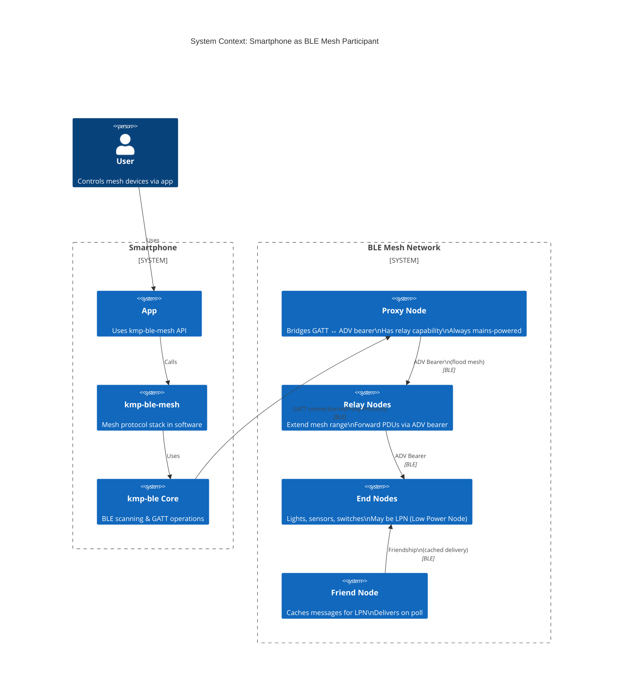

**Fundamental architectural constraint:** The smartphone is a **second-class mesh citizen**. It cannot transmit on the ADV bearer (mobile OSes don't expose raw advertising transmission for mesh). All communication goes through a single GATT Proxy connection. This means:

- **No relaying** - the phone never forwards mesh messages
- **No Friend/LPN role** - phone is either connected (via proxy) or offline
- **Single point of failure** - if the proxy node goes down, the phone loses mesh connectivity
- **Asymmetric bandwidth** - receive is notification-driven (moderate), send is GATT write (limited by connection interval)

### 1.2 Network Topology

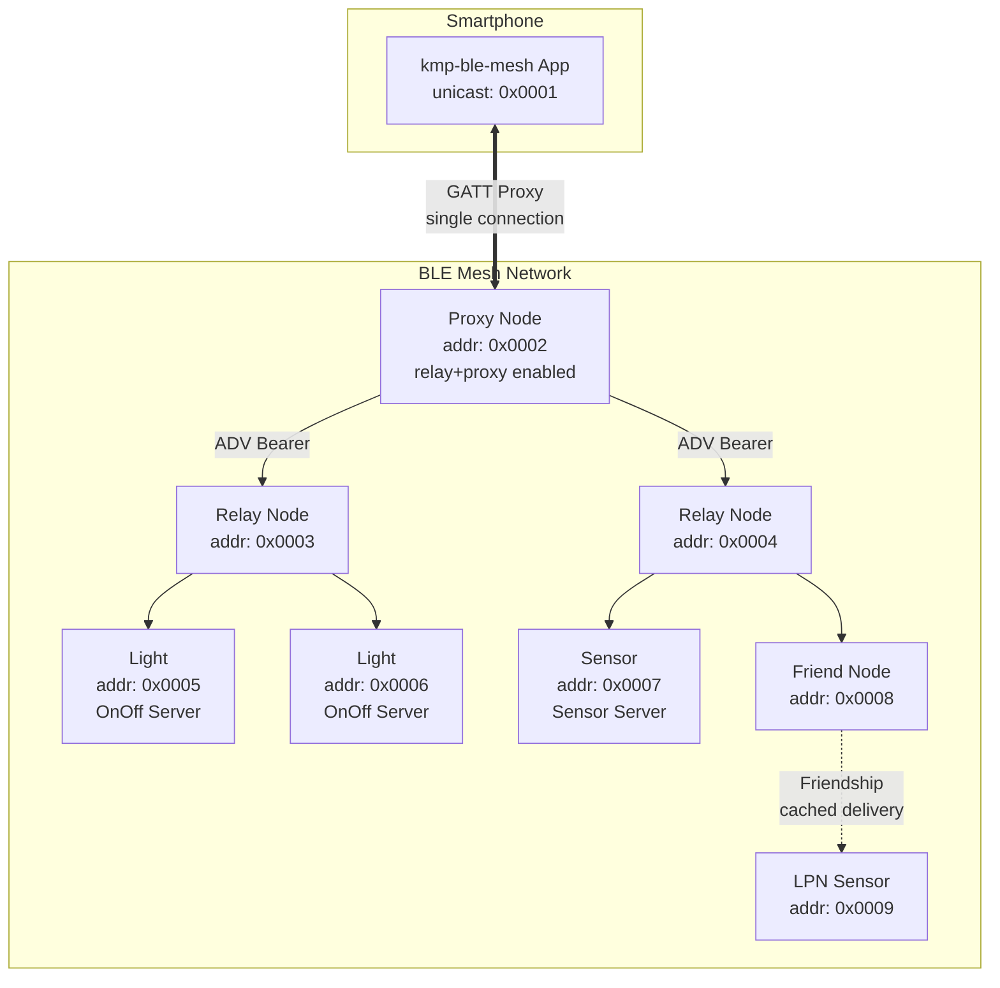

**Address allocation example:**

| Device | Unicast Address | Elements | Models |
|--------|----------------|----------|--------|
| Smartphone | 0x0001 | 1 element | Config Client, Health Client, Generic OnOff Client |
| Proxy Node | 0x0002-0x0004 | 3 elements | Config Server, Health Server, OnOff Server (element 2,3) |
| Relay Node 1 | 0x0005-0x0006 | 2 elements | Config Server, Health Server |
| Light 1 | 0x0007 | 1 element | OnOff Server, Level Server |
| Sensor 1 | 0x0008 | 1 element | Sensor Server |

---

## 2. Protocol Stack Deep Dive

### 2.1 Full Protocol Stack

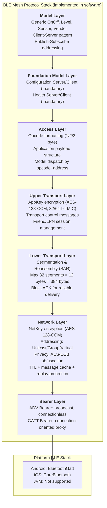

### 2.2 Network PDU Structure (29 bytes max)

```mermaid
packet-beta
    title Network PDU Format (unsegmented access message)
    0-0: "IVI(1b)"
    0-6: "NID(7b)"
    7-7: "CTL(1b)"
    7-13: "TTL(7b)"
    14-37: "SEQ(24b)"
    38-53: "SRC(16b)"
    54-69: "DST(16b)"
    70-197: "TransportPDU(1-16 bytes)"
    198-229: "NetMIC(32b)"
```

### 2.3 Bearer Layer - The Asymmetric Reality

This is the most architecturally significant layer because it's where the smartphone's constraints manifest.

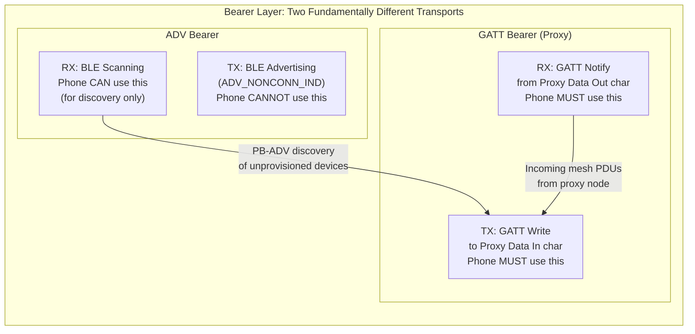

| Bearer | Phone Can Send? | Phone Can Receive? | Used For |
|--------|:---:|:---:|---|
| **ADV Bearer** | ❌ (OS restriction) | ✅ (via Scanner) | Discovering unprovisioned device beacons |
| **GATT Proxy Bearer** | ✅ (via Peripheral.write) | ✅ (via Peripheral.observe) | **All** smartphone mesh communication |

**Architectural implication:** We only need to implement GATT Proxy transmission. The ADV bearer is receive-only for phone, and only used during provisioning discovery. This simplifies the TX side but means the bearer abstraction must be asymmetric.

---

## 3. Architecture Overview

### 3.1 Component Architecture

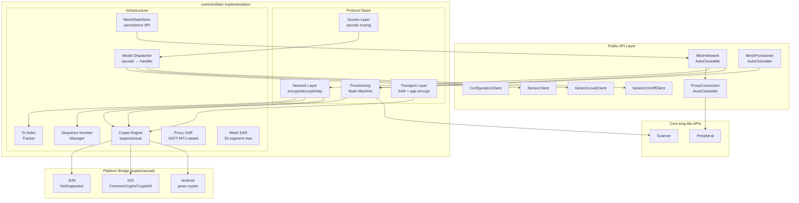

### 3.2 Layer Dependencies (Strict Layering)

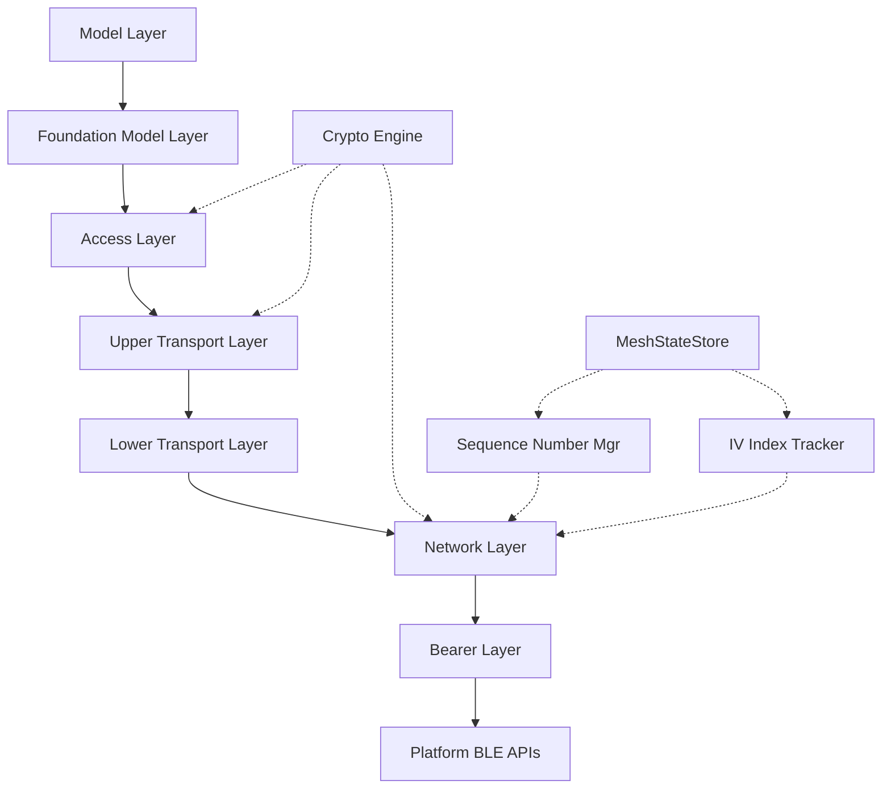

### 3.3 Key Design Decisions

| Decision | Choice | Rationale |
|----------|--------|-----------|
| **API levels** | Raw PDU + High-level model API | Power users need raw access for custom/vendor models; typical users want typed model APIs. Matches existing pattern: `Peripheral.read/write` + `peripheral.heartRateMeasurements()` |
| **Crypto strategy** | Pure Kotlin AES-128-CCM + platform ECDH | AES-128-CCM is a well-defined algorithm with spec test vectors -- a pure Kotlin implementation is portable, auditable, and avoids iOS CCM API gaps. ECDH P-256 uses platform hardware-backed keystores for security. |
| **Crypto fallback** | Pure Kotlin fallback for ALL primitives | If platform crypto fails (rare but possible on some Android OEMs), fallback to pure Kotlin ensures mesh still works. The pure Kotlin impl is production-quality, not just a test stub. |
| **Persistence** | SPI `MeshStateStore` with `InMemory` default | Consumers own their storage backend (DataStore, Keychain, file). Sequence numbers MUST survive crashes -- making this a consumer responsibility with clear documentation is safer than a hidden default. |
| **Concurrency** | `limitedParallelism(1)` dispatcher per proxy + `Mutex` on shared network state | Proven pattern from core library. Per-proxy serialization prevents GATT queue corruption. Mutex on shared state prevents race between incoming message handler and user API calls. |
| **Bearer abstraction** | Asymmetric: read from both ADV+GATT, write only via GATT | Reflects platform reality. Phone cannot TX on ADV bearer. Making this explicit in the type system prevents impossible operations. |
| **Proxy redundancy** | Single proxy with reconnect; multi-proxy in phase 4 | 95% of mesh deployments have one proxy node in phone range. Multi-proxy adds significant complexity (two IV Index sources, duplicate PDU filtering). Design for it but don't build it yet. |
| **Model codegen** | Manual first, codegen later | Early-stage API needs iteration. Once the patterns stabilize for 3+ models, a code generator from SIG XML model definitions becomes high-ROI. |

---

## 4. Module Structure

```
kmp-ble-mesh/
├── build.gradle.kts
├── MODULE.md
└── src/
    ├── commonMain/kotlin/com/atruedev/kmpble/mesh/
    │   ├── MeshNetwork.kt              # Core network interface
    │   ├── MeshNode.kt                 # Provisioned node
    │   ├── MeshElement.kt              # Addressable element
    │   ├── MeshModel.kt                # Model identifier + opcode types
    │   ├── MeshAddress.kt              # UnicastAddress, GroupAddress, VirtualAddress
    │   ├── MeshKey.kt                  # NetworkKey, ApplicationKey, DeviceKey
    │   ├── MeshPdu.kt                  # All PDU type definitions
    │   ├── MeshError.kt                # Error hierarchy (sealed interfaces)
    │   ├── MeshStateStore.kt           # Persistence SPI
    │   ├── ExperimentalMeshApi.kt      # Opt-in annotation for unstable APIs
    │   │
    │   ├── provisioning/
    │   │   ├── MeshProvisioner.kt      # Public provisioner interface
    │   │   ├── ProvisioningBearer.kt   # PB-ADV + PB-GATT bearer abstraction
    │   │   ├── ProvisioningStateMachine.kt  # 5-phase state machine
    │   │   ├── ProvisioningCapabilities.kt  # Device capabilities model
    │   │   ├── ProvisioningData.kt     # Distributed provisioning data
    │   │   └── OobAuthentication.kt    # OOB auth methods
    │   │
    │   ├── network/
    │   │   ├── NetworkLayer.kt         # PDU encode/decode, relay, privacy
    │   │   ├── LowerTransportLayer.kt  # Segmentation & reassembly (mesh SAR)
    │   │   ├── UpperTransportLayer.kt  # AppKey encrypt/decrypt, control msgs
    │   │   ├── AccessLayer.kt          # Opcode format, model dispatch
    │   │   ├── NetworkPduBuilder.kt    # Immutable PDU construction
    │   │   └── MessageCache.kt         # Duplicate detection cache
    │   │
    │   ├── proxy/
    │   │   ├── ProxyClient.kt          # Public proxy connection interface
    │   │   ├── ProxyProtocol.kt        # Proxy PDU format + SAR (GATT-level)
    │   │   ├── ProxyFilter.kt          # Filter types
    │   │   └── MeshProxyService.kt     # UUIDs, GATT characteristic discovery
    │   │
    │   ├── config/
    │   │   ├── ConfigurationClient.kt  # Post-provision config operations
    │   │   └── ConfigMessages.kt       # Config opcode definitions
    │   │
    │   ├── models/
    │   │   ├── ModelDispatcher.kt      # Opcode → handler routing
    │   │   ├── generic/
    │   │   │   ├── GenericOnOffClient.kt
    │   │   │   ├── GenericOnOffServer.kt
    │   │   │   ├── GenericLevelClient.kt
    │   │   │   └── GenericLevelServer.kt
    │   │   ├── sensor/
    │   │   │   ├── SensorClient.kt
    │   │   │   └── SensorServer.kt
    │   │   └── VendorModel.kt           # Custom vendor model registration
    │   │
    │   ├── crypto/
    │   │   ├── CryptoEngine.kt          # expect object: all primitives
    │   │   ├── AesCcm.kt                # Pure Kotlin AES-128-CCM
    │   │   ├── AesCmac.kt               # Pure Kotlin AES-128-CMAC
    │   │   ├── KeyDerivation.kt         # k1/k2/k3/s1 functions
    │   │   └── NonceGenerator.kt        # Per-layer nonce construction
    │   │
    │   ├── internal/
    │   │   ├── MeshNetworkImpl.kt       # Network implementation
    │   │   ├── SequenceNumberManager.kt # 24-bit seq + RPL tracking
    │   │   ├── IvIndexTracker.kt        # IV Index + update procedure
    │   │   ├── SegmentedMessageAssembler.kt  # Inbound reassembly buffers
    │   │   ├── InMemoryMeshStateStore.kt     # Default storage impl
    │   │   └── MeshLogger.kt            # Structured logging
    │   │
    │   └── testing/
    │       ├── FakeMeshNetwork.kt       # Test double
    │       ├── FakeMeshNode.kt          # Test double
    │       ├── FakeProvisioner.kt       # Test double (simulates device)
    │       ├── FakeProxyClient.kt       # Test double (PDU channel)
    │       └── FakeMeshStateStore.kt    # Test double
    │
    ├── commonTest/kotlin/com/atruedev/kmpble/mesh/
    │   ├── crypto/
    │   │   ├── AesCcmTest.kt            # SIG spec test vectors
    │   │   ├── CmacTest.kt              # RFC 4493 test vectors
    │   │   └── KeyDerivationTest.kt     # k1/k2/k3 test vectors
    │   ├── network/
    │   │   ├── NetworkLayerTest.kt
    │   │   └── TransportLayerTest.kt
    │   ├── provisioning/
    │   │   ├── ProvisioningStateMachineTest.kt
    │   │   └── ProvisioningConformanceTest.kt
    │   ├── config/
    │   │   └── ConfigurationClientTest.kt
    │   ├── models/
    │   │   └── GenericOnOffTest.kt
    │   └── MeshNetworkConformanceTest.kt
    │
    ├── androidMain/kotlin/com/atruedev/kmpble/mesh/
    │   └── crypto/CryptoEngine.android.kt  # javax.crypto impl
    │
    └── iosMain/kotlin/com/atruedev/kmpble/mesh/
        └── crypto/CryptoEngine.ios.kt      # CommonCrypto/CryptoKit impl
```

---

## 5. Core Interfaces & Class Diagram

### 5.1 Core Type Hierarchy

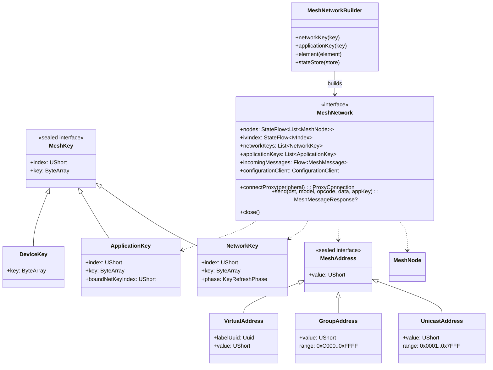

### 5.2 MeshNetwork - The Central Interface

```kotlin
public interface MeshNetwork : AutoCloseable {
    // --- Identity ---
    public val ownUnicastAddress: UnicastAddress

    // --- Observable State ---
    public val nodes: StateFlow<List<MeshNode>>
    public val ivIndex: StateFlow<IvIndex>
    public val isProxyConnected: StateFlow<Boolean>

    // --- Key Management ---
    public val networkKeys: List<NetworkKey>
    public val applicationKeys: List<ApplicationKey>
    public suspend fun addNetworkKey(key: NetworkKey)
    public suspend fun addApplicationKey(key: ApplicationKey)

    // --- Node Management ---
    public suspend fun addNode(node: MeshNode)
    public suspend fun removeNode(address: UnicastAddress)
    public fun findNode(address: UnicastAddress): MeshNode?

    // --- Connectivity ---
    public suspend fun connectProxy(peripheral: Peripheral): ProxyConnection
    public suspend fun disconnectProxy()

    // --- Messaging ---
    public suspend fun send(
        destination: MeshAddress,
        modelId: MeshModelId,
        opcode: MeshOpcode,
        payload: ByteArray,
        appKey: ApplicationKey,
        acknowledged: Boolean = true,
        ttl: UByte = DEFAULT_TTL,
    ): MeshMessageResponse?

    public val incomingMessages: Flow<MeshMessage>

    // --- Configuration ---
    public val configurationClient: ConfigurationClient

    // --- Lifecycle ---
    override fun close()
}
```

### 5.3 MeshNode & MeshElement

```kotlin
public data class MeshNode(
    val unicastAddress: UnicastAddress,
    val deviceKey: DeviceKey,
    val elements: List<MeshElement>,
    val features: NodeFeatures,
    val ttl: UByte = DEFAULT_TTL,
)

public data class NodeFeatures(
    val relay: Boolean = false,
    val proxy: Boolean = false,
    val friend: Boolean = false,
    val lowPower: Boolean = false,
)

public data class MeshElement(
    val index: Int,                    // 0-based within node
    val unicastAddress: UnicastAddress, // nodeAddress + index
    val location: ElementLocation,
    val models: List<MeshModelId>,
)

public value class MeshModelId(val id: UInt) {
    val isSigModel: Boolean get() = id < 0xFFFFu
    val sigId: UShort get() = id.toUShort()
    val vendorId: UShort get() = ((id shr 16) and 0xFFFFu).toUShort()
}
```

### 5.4 Entity Relationship

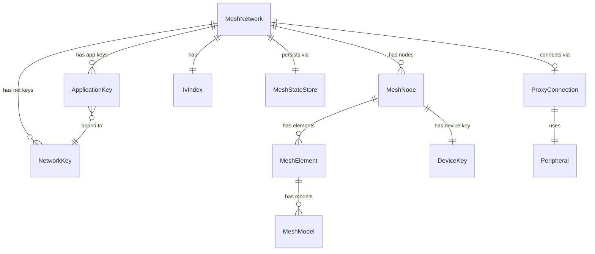

---

## 6. Provisioning Architecture

### 6.1 Provisioning Protocol State Machine

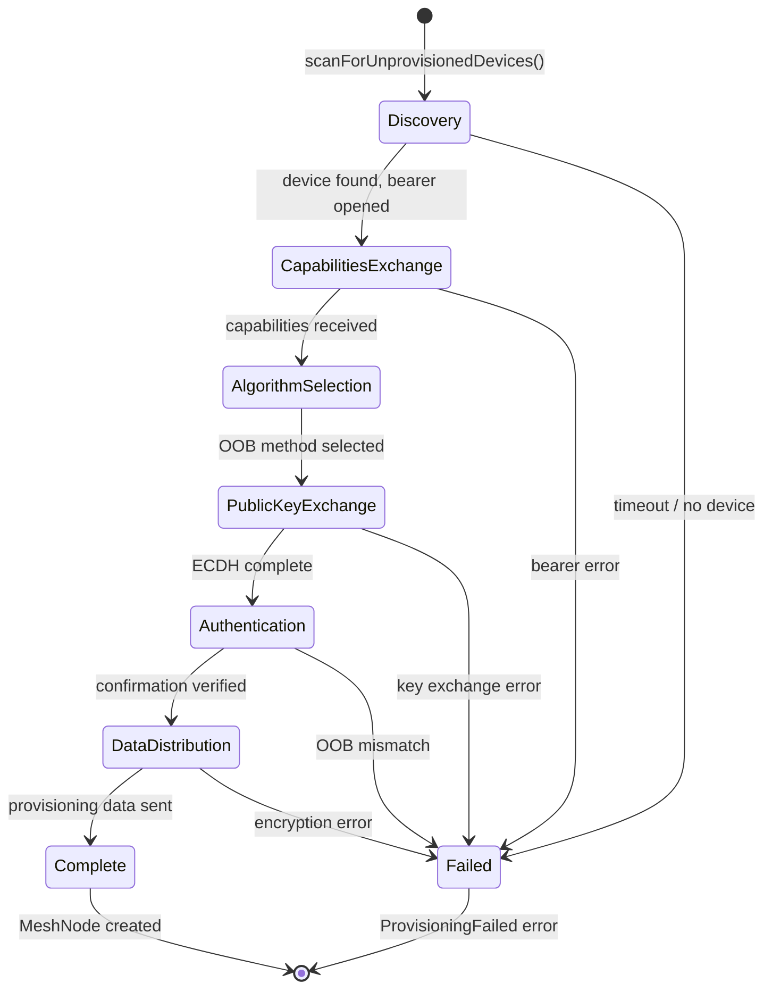

### 6.2 Provisioning Sequence Diagram

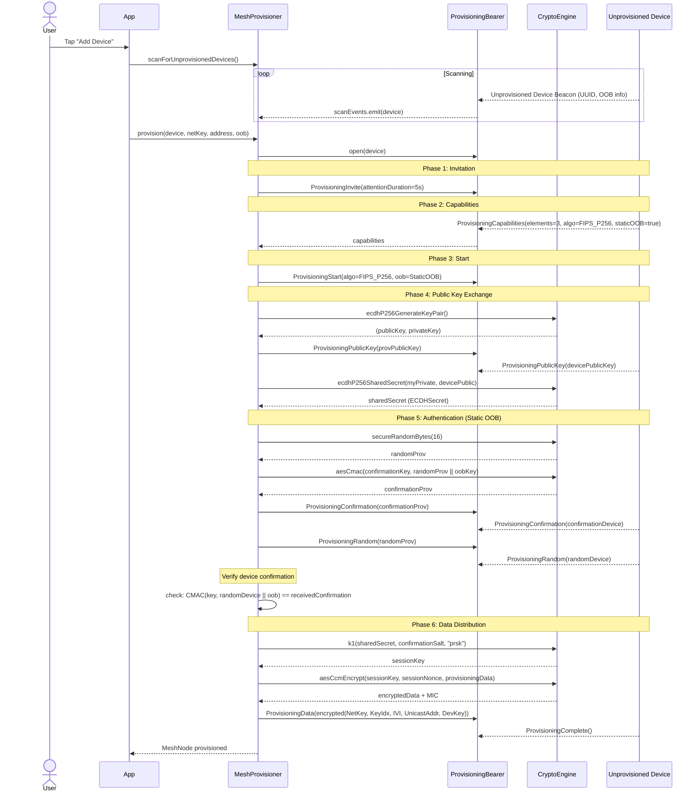

### 6.3 OOB Authentication Methods

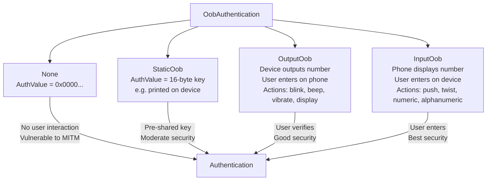

---

## 7. Crypto Architecture

### 7.1 Key Hierarchy

```mermaid
graph TD
    subgraph "Key Hierarchy (from Mesh Spec)"
        NetKey[NetworkKey<br/>Shared by all nodes in subnet<br/>Encrypts Network Layer]
        AppKey[ApplicationKey<br/>Bound to one NetKey<br/>Encrypts Access Layer]
        DevKey[DeviceKey<br/>Unique per node<br/>Encrypts Config messages]

        subgraph "Derived Keys (computed, never stored)"
            EncKey[Encryption Key<br/>K2(NetKey, 0x00)]
            PrivKey[Privacy Key<br/>K2(NetKey, 0x01)]
            NID[Network ID<br/>K2(NetKey, 0x02)<br/>7-bit, in PDU header]
            IdentityKey[Identity Key<br/>K1(NetKey, IdentitySalt, DevKey)<br/>For proxy advertising]
            BeaconKey[Beacon Key<br/>K1(NetKey, BeaconSalt, 0x00)<br/>For secure network beacons]
            SessionKey[Session Key<br/>K1(ECDHSecret, ConfirmationSalt, "prsk")<br/>For provisioning data encryption]
            ConfirmationKey[Confirmation Key<br/>K1(ECDHSecret, ConfirmationSalt, "prck")]
        end
    end

    NetKey --> EncKey
    NetKey --> PrivKey
    NetKey --> NID
    NetKey --> IdentityKey
    NetKey --> BeaconKey
    DevKey --> IdentityKey
    AppKey -.->|bound to| NetKey
```

### 7.2 Crypto Engine Design

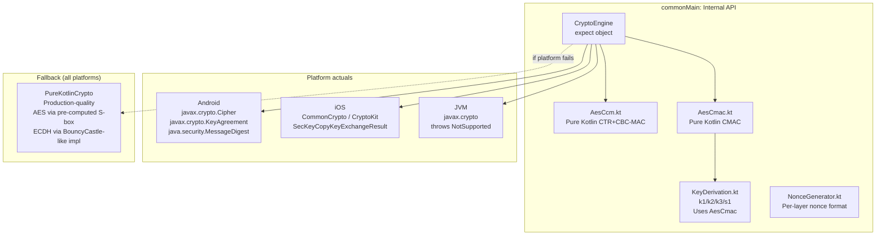

**Why pure Kotlin AES-128-CCM?** iOS CommonCrypto does not expose CCM mode directly (it has CTR and CBC-MAC separately, but combining them correctly for CCM with variable MIC sizes is non-trivial). Rather than platform-specific CCM implementations that diverge in edge cases, a single pure Kotlin implementation with SIG spec test vectors gives us determinism and portability. ECDH and SHA-256 are different: they're simple enough that platform APIs are safe and provide hardware-backed key storage.

### 7.3 Nonce Construction

Each protocol layer constructs its own nonce to prevent cross-layer nonce reuse:

| Layer | Nonce Bytes | Format |
|-------|------------|--------|
| Network | 13 bytes | `[NonceType(1)] [IVI+SEQ(4)] [SRC(2)] [DST(2)] [IVI(4)]` |
| Upper Transport (App) | 13 bytes | `[NonceType(1)] [SRC(2)] [DST(2)] [SEQ(3)] [SZMIC(1)] [IVI(4)]` |
| Proxy | 13 bytes | `[NonceType(1)] [SeqNum(4)] [SRC(2)] [DST(2)] [IVI(4)]` |
| Provisioning | 13 bytes | `[NonceType(1)] [SeqNum(4)] [SRC(2)] [DST(2)] [IVI(4)]` |

The `NonceType` byte ensures nonces from different layers can never collide even if all other fields are identical.

---

## 8. Proxy Transport Architecture

### 8.1 Proxy Connection Lifecycle

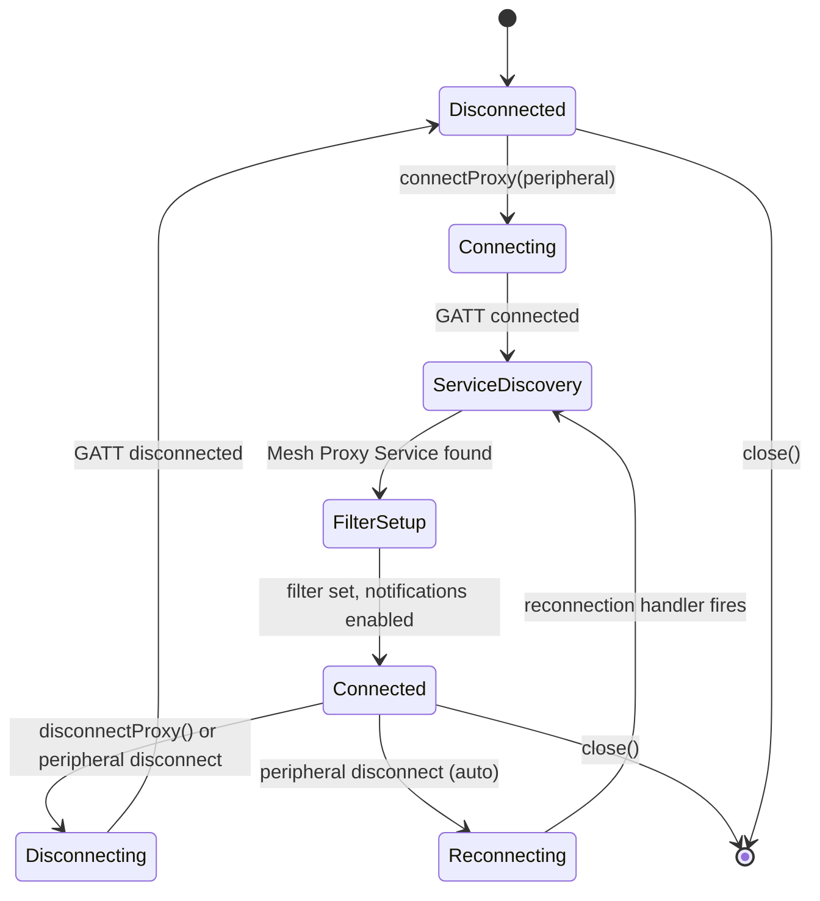

### 8.2 Proxy PDU SAR (Double SAR Architecture)

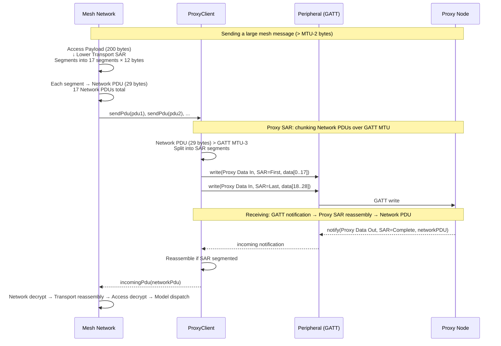

**Critical architectural distinction:** There are TWO independent SAR layers:
1. **Proxy SAR** (GATT-level): Splits Network PDUs across GATT writes/notifications when PDU > (MTU-3)
2. **Mesh Transport SAR** (mesh-level): Splits Access messages across Network PDUs when payload > 15 bytes

These must not be conflated. The Proxy layer is transparent to the mesh stack -- it reassembles Network PDUs before passing them up.

### 8.3 Bearer Abstraction

```kotlin
internal interface MeshBearer : AutoCloseable {
    val incomingPdus: Flow<NetworkPdu>    // Reassembled Network PDUs
    val isOpen: StateFlow<Boolean>
    suspend fun send(pdu: NetworkPdu)     // Single Network PDU (proxy SAR handled internally)
    suspend fun open()
}

// GATT Proxy - the ONLY TX-capable bearer on smartphone
internal class GattProxyBearer(
    private val peripheral: Peripheral,
    private val proxyFilter: ProxyFilter = ProxyFilter.AcceptAll,
) : MeshBearer

// ADV Bearer - RX ONLY for unprovisioned device beacons
internal class AdvScanBearer(
    private val scanner: Scanner,
) : MeshBearer {
    // send() throws UnsupportedOperationException - phone cannot TX on ADV bearer
}
```

---

## 9. Message Flow Architecture

### 9.1 Send Flow (Outbound)

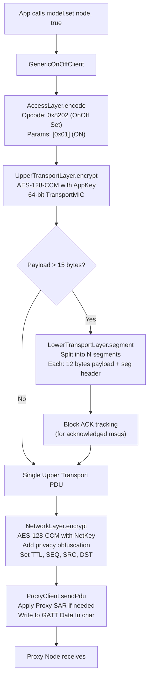

### 9.2 Receive Flow (Inbound)

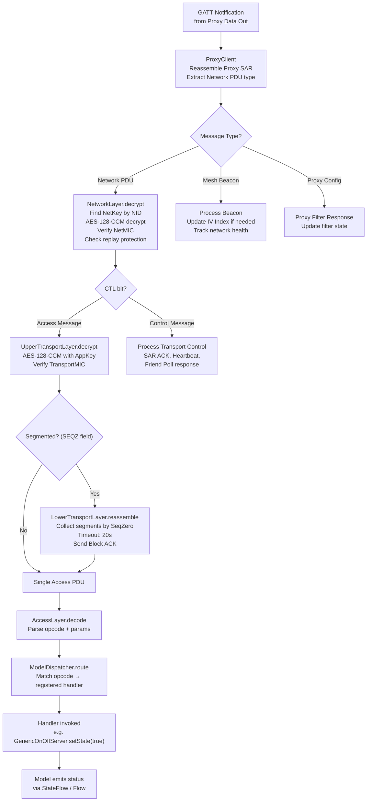

### 9.3 Message Acknowledgment Pattern

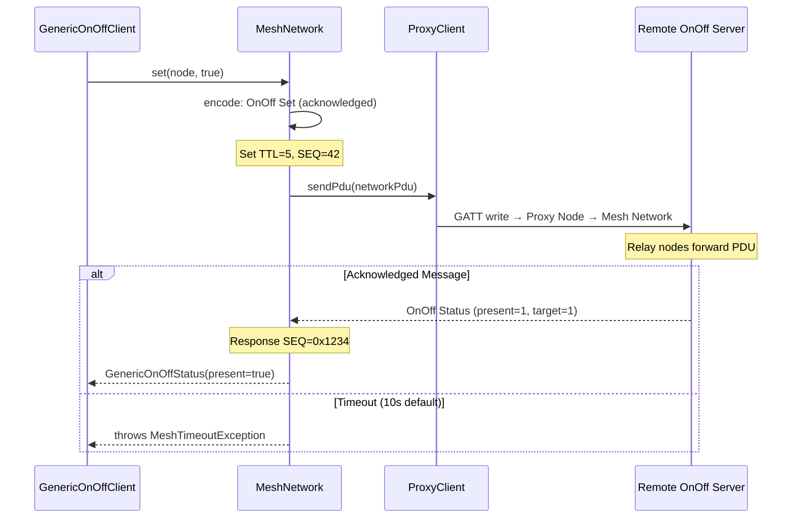

---

## 10. Concurrency & Threading Model

```mermaid
graph TB
    subgraph "Per-Proxy Connection"
        direction TB
        GATT[GATT Callback Thread<br/>Platform-specific<br/>Android: HandlerThread<br/>iOS: DispatchQueue]
        PD[Proxy Dispatcher<br/>Dispatchers.Default<br/>.limitedParallelism(1)]
        CH[Channel<br/>UNLIMITED capacity<br/>Buffered to prevent<br/>backpressure on GATT thread]
    end

    subgraph "Shared Network State"
        MUT[Mutex<br/>Guards all shared state]
        STATE[MeshNetworkState<br/>nodes, keys, IV Index<br/>sequence numbers]
    end

    subgraph "Consumer Coroutines"
        C1[Model API caller<br/>e.g. onOff.set()]
        C2[Message observer<br/>e.g. incomingMessages.collect{}]
        C3[Provisioner caller<br/>e.g. provisioner.provision()]
    end

    GATT -->|"CompletableDeferred.complete()"| CH
    CH -->|"receiveAsFlow()"| PD
    PD -->|"Mutex.withLock{}"| MUT
    MUT --> STATE

    C1 -->|"suspend fun<br/>runs on caller's context"| MUT
    C2 -->|"Flow.collect<br/>runs on collector's context"| MUT
    C3 -->|"suspend fun<br/>runs on caller's context"| MUT
```

**Key concurrency rules:**
1. GATT callbacks complete `CompletableDeferred` values -- they NEVER touch shared state directly
2. The proxy dispatcher (`limitedParallelism(1)`) serializes all proxy-bound operations: writes, SAR reassembly, PDU processing
3. Shared network state is guarded by `Mutex` -- both the proxy dispatcher and consumer coroutines acquire it
4. Sequence number allocation is atomic via `AtomicInt` (atomicfu) -- no mutex needed for increment-only counter
5. Consumer API calls run on the caller's coroutine context, acquiring the mutex only when reading/writing shared state

---

## 11. Sequence Number & IV Index Management

### 11.1 Sequence Number Lifecycle

```mermaid
stateDiagram-v2
    [*] --> Normal: SEQ = 0
    Normal --> Normal: SEQ++ on each message send
    Normal --> Warning: SEQ approaches 0xFFFFFF (16.7M)
    Warning --> IVUpdateRequired: SEQ at 95% capacity
    IVUpdateRequired --> [*]: IV Index update procedure<br/>resets all SEQ to 0
    Normal --> Persisted: save to MeshStateStore
    Persisted --> Normal: restore on next app launch
```

**Critical invariant:** A (SEQ, IV Index, Source Address) tuple MUST never repeat. If it does, other mesh nodes will reject the message as a replay attack and may blacklist the source.

### 11.2 IV Index Update Procedure

```mermaid
sequenceDiagram
    participant Net as Mesh Network
    participant Phone as Smartphone (our node)
    participant Proxy as Proxy Node
    participant Mesh as Rest of Mesh

    Note over Mesh: Network-wide IV Update begins
    Mesh-->>Proxy: Secure Network Beacon<br/>IV Index: N+1, Flag: IV Update Active
    Proxy-->>Phone: Network PDU with IVI=1<br/>(using new IV Index)

    Note over Phone: Enter IV Update In Progress state
    Phone->>Phone: Accept PDUs with IV=N or IV=N+1
    Phone->>Phone: Send PDUs with IV=N (old)<br/>until we receive SNB with IV Update Active=0

    Mesh-->>Proxy: Secure Network Beacon<br/>IV Index: N+1, Flag: Normal
    Proxy-->>Phone: SNB confirms update complete

    Note over Phone: Transition to Normal state
    Phone->>Phone: set IV Index = N+1
    Phone->>Phone: reset all sequence numbers to 0
    Phone->>Phone: persist new IV Index + seq numbers
    Phone->>Phone: Send PDUs with IV=N+1 (new)
```

### 11.3 Replay Protection List (RPL)

```kotlin
internal class ReplayProtectionList(
    private val capacity: Int = 256,  // per source address
) {
    // Stores seen (seq, ivIndex) pairs for each source address
    // Any message with seq <= lastSeen for the same IV Index is REJECTED
    // New IV Index automatically clears the old entries
    fun checkAndUpdate(src: UnicastAddress, seq: UInt, ivi: Int): Boolean
    fun evictOldest(src: UnicastAddress)
}
```

---

## 12. Persistence Architecture

### 12.1 What Must Be Persisted (and Why)

| Data | Criticality | Consequence of Loss |
|------|------------|-------------------|
| **Sequence Numbers** | **CRITICAL** | Node permanently rejected from network (replay protection) |
| **IV Index** | **CRITICAL** | Cannot decrypt any network messages |
| **Network Keys** | High | Cannot participate in network (must re-provision) |
| **Application Keys** | High | Cannot send/receive model messages |
| **Device Keys** | High | Cannot configure nodes |
| **Node List** | Medium | Must re-discover nodes (via composition data) |
| **Composition Data** | Low | Can re-fetch from each node |

### 12.2 Persistence Interface

```kotlin
public interface MeshStateStore {
    /**
     * Atomically save the complete network state.
     * Called on every sequence number change and IV Index update.
     * Implementation MUST be durable before returning.
     */
    suspend fun saveNetworkState(state: MeshNetworkState): Result<Unit>

    /**
     * Load the last saved network state.
     * Returns null if no state exists (first launch).
     */
    suspend fun loadNetworkState(): Result<MeshNetworkState?>

    /**
     * Clear all persisted state.
     * Called when leaving a mesh network.
     */
    suspend fun clearAll(): Result<Unit>
}

public data class MeshNetworkState(
    val ivIndex: IvIndex,
    val unicastAddress: UnicastAddress,
    val networkKeys: List<NetworkKey>,
    val applicationKeys: List<ApplicationKey>,
    val nodes: List<PersistedNodeState>,
)

public data class PersistedNodeState(
    val unicastAddress: UnicastAddress,
    val deviceKey: DeviceKey,
    val lastSequenceNumber: UInt,
    val features: NodeFeatures,
)
```

### 12.3 Atomic Persistence Strategy

```mermaid
flowchart TD
    A[Sequence number incremented] --> B[Update in-memory state]
    B --> C[Call MeshStateStore.saveNetworkState]
    C --> D{Save successful?}
    D -->|Yes| E[Continue operation]
    D -->|No| F[Log error<br/>Retry with backoff]
    F --> G{Retry succeeded?}
    G -->|Yes| E
    G -->|No, max retries| H["CRITICAL: persist in-memory<br/>Do NOT send more messages<br/>until persistence recovers"]
```

**The cardinal rule:** Never send a mesh message whose sequence number has not been durably persisted. Losing a sequence number means permanent exclusion from the network.

---

## 13. Model Dispatch Architecture

### 13.1 Opcode Registry

```mermaid
graph TD
    subgraph "Model Dispatcher"
        Registry[OpcodesRegistry<br/>Map~Int, ModelHandler~]
        Router[MessageRouter<br/>dispatch(address, opcode, params)]
    end

    subgraph "Registered Handlers"
        H1[GenericOnOffServer<br/>opcodes: 0x8201-0x8204, 0x82E4]
        H2[GenericLevelServer<br/>opcodes: 0x8205-0x820A, 0x82E5-0x82E6]
        H3[ConfigurationServer<br/>opcodes: 0x8000-0x803F]
        H4[HealthServer<br/>opcodes: 0x803E-0x804D]
        H5[VendorModel<br/>opcode: 0xC00000 +]
    end

    Router --> Registry
    Registry --> H1
    Registry --> H2
    Registry --> H3
    Registry --> H4
    Registry --> H5
```

### 13.2 Dispatch Flow

```kotlin
internal class MessageRouter(
    private val registry: OpcodeRegistry,
    private val network: MeshNetwork,
) {
    suspend fun dispatch(
        source: UnicastAddress,
        destination: MeshAddress,
        opcode: MeshOpcode,
        params: ByteArray,
        appKey: ApplicationKey?,
    ) {
        val handler = registry.find(opcode)
            ?: run {
                // Unknown opcode - ignore silently per mesh spec
                // (don't NACK, that would flood the network)
                return
            }

        // Verify destination matches our address
        when (destination) {
            is UnicastAddress -> {
                if (destination != network.ownUnicastAddress) return
            }
            is GroupAddress -> {
                // Check if we subscribe to this group
                if (!network.isSubscribed(destination)) return
            }
            is VirtualAddress -> {
                // Check virtual address subscription
                if (!network.isSubscribed(destination)) return
            }
        }

        // Route to handler on the correct element
        handler.handle(source, destination, opcode, params, appKey)
    }
}
```

---

## 14. Standard Models

### 14.1 Model Client Pattern

```kotlin
// All model clients follow this pattern:
public class GenericOnOffClient internal constructor(
    private val network: MeshNetwork,
    private val appKey: ApplicationKey,
) {
    public suspend fun get(elementAddress: UnicastAddress): GenericOnOffStatus
    public suspend fun set(elementAddress: UnicastAddress, state: Boolean,
                           transitionTime: TransitionTime? = null): GenericOnOffStatus
    public suspend fun setUnacknowledged(elementAddress: UnicastAddress, state: Boolean)
    public fun onStatusChanged(elementAddress: UnicastAddress): Flow<GenericOnOffStatus>
}

public data class GenericOnOffStatus(
    val presentOnOff: Boolean,
    val targetOnOff: Boolean? = null,
    val remainingTime: TransitionTime? = null,
)

// Transition time encoding for smooth dimming:
public value class TransitionTime(val milliseconds: UInt) {
    val encodedValue: UByte  // 6-bit resolution + 2-bit step encoding
}
```

### 14.2 Model Server Pattern

```kotlin
public class GenericOnOffServer internal constructor(
    private val element: MeshElement,
    private val appKey: ApplicationKey,
) {
    /** Current state exposed as StateFlow for UI binding */
    public val state: StateFlow<Boolean>

    /** Set state locally (for local control) */
    public suspend fun setState(on: Boolean)

    /** Handle incoming GET/SET from remote clients */
    internal suspend fun handleMessage(
        source: UnicastAddress,
        opcode: MeshOpcode,
        params: ByteArray,
    ): ByteArray?  // null for unacknowledged, response bytes for acknowledged
}
```

---

## 15. Error Architecture

```kotlin
// Following the kmp-ble error pattern: composable sealed interfaces
public sealed interface MeshError

// --- Provisioning ---
public sealed interface ProvisioningError : MeshError
public data class ProvisioningFailed(
    val phase: ProvisioningPhase,
    val reason: String,
    val recoveryHint: String = "Retry provisioning. Verify device is in range and not already provisioned.",
) : ProvisioningError

public data class ProvisioningTimeout(
    val timeout: Duration,
    val recoveryHint: String = "Increase timeout or verify device responsiveness.",
) : ProvisioningError

public data class OobAuthenticationFailed(
    val method: String,
    val recoveryHint: String = "Verify the OOB key/display matches the device.",
) : ProvisioningError

// --- Transport ---
public sealed interface MeshTransportError : MeshError
public data class ProxyConnectionFailed(
    val reason: String,
    val recoveryHint: String = "Verify proxy node is in range and has proxy feature enabled.",
) : MeshTransportError

public data class ProxyDisconnected(
    val reason: String,
    val recoveryHint: String = "Reconnecting... If persistent, try another proxy node.",
) : MeshTransportError

public data class MessageTimeout(
    val operation: String,
    val timeout: Duration,
    val recoveryHint: String = "No response from mesh node. Check device is online.",
) : MeshTransportError

// --- Crypto ---
public sealed interface MeshCryptoError : MeshError
public data class DecryptionFailed(
    val details: String,
    val recoveryHint: String = "Possible IV Index mismatch. Verify network keys.",
) : MeshCryptoError

// --- Configuration ---
public sealed interface ConfigurationError : MeshError
public data class ConfigurationRejected(
    val opcode: Int,
    val statusCode: UByte,
    val recoveryHint: String = "Configuration command rejected by node.",
) : ConfigurationError

// --- Platform ---
public data class MeshNotSupported(
    val message: String = "BLE Mesh is not supported on this platform",
) : Exception(message), MeshError

// --- Exception wrapper (following BleException pattern) ---
public data class MeshException(
    public val error: MeshError,
) : Exception(error.toString())
```

---

## 16. Testing Architecture

### 16.1 Fake Hierarchy

```mermaid
classDiagram
    class FakeMeshNetwork {
        +MutableStateFlow nodes
        +MutableStateFlow ivIndex
        +addNode(node)
        +simulateIncomingMessage(msg)
        +getSentMessages(): List
        +simulateDisconnect()
    }
    class FakeMeshNode {
        +unicastAddress
        +elements
        +deviceKey
        +features
        +queueResponse(opcode, response)
    }
    class FakeProvisioner {
        +scanEvents: MutableSharedFlow
        +queueProvisioningResult(node)
        +simulateBearerError(error)
        +simulateProvisioningProgress(progress)
        +getLastProvisionRequest()
    }
    class FakeProxyClient {
        +incomingPdus: Channel
        +sendLog: List
        +connected: MutableStateFlow
        +simulatePdu(pdu)
        +simulateDisconnect()
    }
    class FakeMeshStateStore {
        +savedStates: List
        +loadResult: Result
        +saveFails: Boolean
    }

    MeshNetwork <|.. FakeMeshNetwork
    MeshProvisioner <|.. FakeProvisioner
    ProxyConnection <|.. FakeProxyClient
    MeshStateStore <|.. FakeMeshStateStore
```

### 16.2 Test Pyramid

```mermaid
graph TB
    subgraph "Integration Tests (commonTest + device)"
        INT[End-to-end:<br/>Provision → Configure → Message<br/>via FakePeripheral + FakeProxyClient]
    end
    subgraph "Conformance Tests (commonTest)"
        CONF[Abstract conformance tests<br/>Platform runners in jvmTest/iosTest]
    end
    subgraph "Unit Tests (commonTest)"
        UNIT1[Crypto: test vectors<br/>from SIG spec + RFC 4493]
        UNIT2[Protocol: state machines<br/>Provisioning, SAR, IV Update]
        UNIT3[PDU: encode/decode<br/>round-trips with edge cases]
        UNIT4[Models: message format<br/>encode/decode + state mgmt]
    end

    INT --> CONF
    CONF --> UNIT1
    CONF --> UNIT2
    CONF --> UNIT3
    CONF --> UNIT4
```

### 16.3 Key Test Scenarios

| Test | What it validates | Uses |
|------|------------------|------|
| `AesCcmTest` | AES-128-CCM against SIG spec test vectors (Annex C) | Pure Kotlin implementation |
| `CmacTest` | AES-128-CMAC against RFC 4493 test vectors | Pure Kotlin implementation |
| `KeyDerivationTest` | k1/k2/k3 with known test vectors | Correct key derivation |
| `ProvisioningStateMachineTest` | Full provisioning flow with NoOob/StaticOob | State transitions + crypto |
| `TransportSarTest` | Segmentation of 200-byte payload, out-of-order reassembly, timeout | Lower transport layer |
| `NetworkLayerTest` | PDU encrypt/decrypt, privacy obfuscation, TTL handling, replay detection | Network layer |
| `ProxySarTest` | Proxy-level SAR with various MTU sizes | Proxy client |
| `IvUpdateTest` | IV Index update procedure: accept old+new, reject old after transition | IV Index tracker |
| `SequenceNumberTest` | Sequence number overflow, RPL eviction | Sequence number manager |
| `ModelDispatchTest` | Opcode routing to correct handler, group/virtual address filtering | Message router |
| `PersistenceTest` | Save/load network state, sequence number recovery | MeshStateStore |
| `ConformanceTest` | Abstract test class with Fake* factories, platform runners | Full stack |

---

## 17. Phased Implementation Plan

| Phase | Deliverables | Key Files | LOC | Risk |
|-------|-------------|-----------|-----|------|
| **Phase 1: Foundation** | Core types (address, key, node, element, model, PDU), crypto primitives (AES-CCM, CMAC, ECDH, SHA-256, key derivation), provisioning state machine (PB-ADV + PB-GATT), error hierarchy | ~18 | 1500-2000 | Crypto correctness, provisioning interop |
| **Phase 2: Connectivity** | Network layer (encrypt/decrypt, privacy, relay), transport layers (SAR + app encrypt), access layer (opcode format), GATT proxy client (connect, SAR, filter), basic send/receive | ~14 | 2000-2500 | SAR complexity, proxy interop |
| **Phase 3: Management** | Configuration client (AppKey, publish, subscribe, features), Health model, Composition data parsing, IV Index tracker, RPL | ~8 | 1200-1500 | Config state machine correctness |
| **Phase 4: Usability** | Generic OnOff/Level/Sensor clients, MeshStateStore SPI + InMemory impl, Model dispatcher, Vendor model registration, integration tests, sample | ~12 | 1500-2000 | Model interop, persistence durability |
| **Total** | | **~52** | **6200-8000** | |

---

## 18. Key Design Decisions & Trade-offs

| Decision | Pros | Cons | Chosen Because |
|----------|------|------|----------------|
| **Pure Kotlin AES-128-CCM** | Single implementation, portable, auditable, deterministic behavior across platforms | ~2-5x slower than hardware AES (negligible for 30-byte PDUs) | iOS lacks CCM API; single code path avoids platform-specific CCM bugs |
| **Asymmetric bearer (RX ADV + GATT, TX GATT only)** | Matches platform reality, type-safe (can't accidentally TX on ADV) | Abstraction is not clean -- `send()` on ADV bearer throws | Platform constraint, not design choice. Making it explicit prevents bugs |
| **SPI persistence vs built-in** | Consumers own storage; can use secure enclave/keychain for keys | More work for consumer; risk of incorrect implementation | Security-critical data (keys) should be in platform-secure storage. Library can't know the right backend |
| **`limitedParallelism(1)` per proxy** | No locks, simple reasoning, matches core library pattern | One slow operation blocks all proxy traffic (mitigated by timeouts) | Proven pattern; mesh message latency is dominated by BLE connection interval (7.5-30ms), not dispatcher overhead |
| **`Mutex` on shared state** | Simple, familiar to Kotlin devs, composable with suspend | Potential contention if many concurrent callers (unlikely for BLE) | Mesh operations are inherently serial (one proxy connection). Contention is theoretical, not practical |
| **Manual models before codegen** | Flexible API design, quick iteration | Boilerplate for each new model | Early stage needs API exploration; codegen ROI increases with model count |
| **Single proxy connection (phase 1-3)** | Simple connection management, single source of truth for IV Index | Single point of failure; proxy node outage = phone offline | 95% of use cases have one proxy in range. Multi-proxy adds non-trivial complexity (duplicate PDU detection, dual IV Index sources) |

---

## 19. Risk Assessment

```mermaid
graph TD
    subgraph "High Risk"
        R1["Crypto correctness<br/>Mitigation: SIG spec test vectors<br/>for every primitive"]
        R2["Sequence number durability<br/>Mitigation: Atomic save-before-send<br/>Consumer docs emphasize criticality"]
        R3["Proxy interop with real nodes<br/>Mitigation: Test against Nordic nRF<br/>and Espressif ESP32 proxy nodes"]
    end
    subgraph "Medium Risk"
        R4["IV Index update handling<br/>Mitigation: Test old+new acceptance<br/>window; spec-compliant state machine"]
        R5["iOS GATT notification reliability<br/>Mitigation: Core kmp-ble observation<br/>resilience already handles this"]
        R6["Segmented message timeout<br/>Mitigation: 20s default, configurable<br/>per-network"]
    end
    subgraph "Low Risk"
        R7["PB-ADV discovery reliability<br/>Mitigation: PB-GATT is primary<br/>provisioning path for mobile"]
        R8["OOB UX complexity<br/>Mitigation: NoOob default for dev<br/>devices; clear docs for production"]
    end

    style R1 fill:#ff6b6b
    style R2 fill:#ff6b6b
    style R3 fill:#ff6b6b
    style R4 fill:#ffd93d
    style R5 fill:#ffd93d
    style R6 fill:#ffd93d
    style R7 fill:#6bff6b
    style R8 fill:#6bff6b
```

---

## 20. Build Configuration

```kotlin
// kmp-ble-mesh/build.gradle.kts
plugins {
    alias(libs.plugins.kotlin.multiplatform)
    alias(libs.plugins.android.library)
    alias(libs.plugins.vanniktech.publish)
    alias(libs.plugins.dokka)
}

group = "com.atruedev"
version = providers.environmentVariable("VERSION").getOrElse("0.0.0-local")

kotlin {
    explicitApi()

    compilerOptions {
        freeCompilerArgs.add("-opt-in=kotlin.uuid.ExperimentalUuidApi")
    }

    android {
        namespace = "com.atruedev.kmpble.mesh"
        compileSdk = libs.versions.androidCompileSdk.get().toInt()
        minSdk = libs.versions.androidMinSdk.get().toInt()
        withHostTestBuilder {}.configure {}
    }

    jvm()

    listOf(iosArm64(), iosSimulatorArm64(), iosX64()).forEach { target ->
        target.binaries.framework {
            baseName = "KmpBleMesh"
            isStatic = true
        }
    }

    sourceSets {
        commonMain.dependencies {
            api(project(":"))
            implementation(libs.kotlinx.coroutines.core)
            implementation(libs.kotlinx.atomicfu)
        }
        commonTest.dependencies {
            implementation(libs.kotlin.test)
            implementation(libs.kotlinx.coroutines.test)
            implementation(libs.turbine)
        }
    }
}

dokka {
    dokkaPublications.html {
        moduleName.set("kmp-ble-mesh")
        includes.from("MODULE.md")
    }
}

mavenPublishing {
    publishToMavenCentral()
    signAllPublications()
    coordinates("com.atruedev", "kmp-ble-mesh", version.toString())
    pom {
        name.set("kmp-ble-mesh")
        description.set("BLE Mesh networking support for kmp-ble - provisioning, proxy, models")
        url.set("https://github.com/gary-quinn/kmp-ble")
        licenses {
            license {
                name.set("Apache-2.0")
                url.set("https://www.apache.org/licenses/LICENSE-2.0")
            }
        }
        developers {
            developer {
                id.set("gary-quinn")
                name.set("Gary Quinn")
                email.set("gary@atruedev.com")
            }
        }
        scm {
            url.set("https://github.com/gary-quinn/kmp-ble")
        }
    }
}
```

**Registration:** `include(":kmp-ble-mesh")` in `settings.gradle.kts`

---

## 21. Usage Example

```kotlin
// === 1. Create mesh network ===
val network = MeshNetwork {
    networkKey(myNetKey)
    applicationKey(myAppKey)
    element(MeshElement(
        index = 0,
        unicastAddress = UnicastAddress(0x0001u),
        location = ElementLocation.MAIN,
        models = listOf(MeshModelId.GenericOnOffClient),
    ))
    stateStore(platformStateStore)  // your platform's secure storage impl
}

// === 2. Discover and provision devices ===
val provisioner = MeshProvisioner()
provisioner.scanEvents
    .filter { it.bearerType == ProvisioningBearerType.PB_GATT }
    .collect { device ->
        println("Found unprovisioned device: ${device.uuid}")

        try {
            val node = provisioner.provision(
                device = device,
                networkKey = myNetKey,
                unicastAddress = allocateNextAddress(),
                oobAuth = OobAuthentication.None,
            )
            network.addNode(node)
            println("Provisioned: ${node.unicastAddress}")

            // === 3. Configure node ===
            val config = network.configurationClient
            config.addAppKey(node, myAppKey,
                listOf(MeshModelId.GenericOnOffServer))
            config.setPublication(node,
                MeshModelId.GenericOnOffServer,
                network.ownUnicastAddress, myAppKey.index)
            config.addSubscription(node,
                MeshModelId.GenericOnOffServer,
                GroupAddress(0xC001u))
        } catch (e: MeshException) {
            when (e.error) {
                is ProvisioningFailed -> println("Failed: ${e.error.reason}")
                is OobAuthenticationFailed -> println("OOB mismatch!")
                else -> throw e
            }
        }
    }

// === 4. Connect to mesh via proxy ===
val proxyPeripheral = /* discovered via Scanner or known address */
val proxy = network.connectProxy(proxyPeripheral)
println("Connected to mesh via proxy: ${proxy.isConnected.value}")

// === 5. Use model APIs ===
val onOff = GenericOnOffClient(network, myAppKey)
val lightNode = network.findNode(UnicastAddress(0x0005u))!!

// Read current state
val status = onOff.get(lightNode.unicastAddress)
println("Light is: ${if (status.presentOnOff) "ON" else "OFF"}")

// Turn on
onOff.set(lightNode.unicastAddress, true)

// Dim over 2 seconds
onOff.set(lightNode.unicastAddress, true, TransitionTime(2000u))

// Observe status changes (e.g., from physical switch)
onOff.onStatusChanged(lightNode.unicastAddress).collect { update ->
    println("Light changed: ${if (update.presentOnOff) "ON" else "OFF"}")
}

// === 6. Cleanup ===
network.close()  // disconnects proxy, releases all resources
```

---

## 22. References

| Resource | URL |
|----------|-----|
| Bluetooth Mesh Protocol v1.1 | https://www.bluetooth.com/specifications/mesh-specification/ |
| Bluetooth Mesh Model v1.1 | https://www.bluetooth.com/specifications/mesh-model-specification/ |
| Mesh Security Overview v1.0 (2025) | https://www.bluetooth.com/wp-content/uploads/2025/04/MeshSecurityOverview_INFO_v1.0-1.pdf |
| Nordic nRF Mesh Library (Android) | https://github.com/nordicsemiconductor/Android-nRF-Mesh-Library |
| Nordic nRF Mesh Library (iOS) | https://github.com/nordicsemiconductor/IOS-nRF-Mesh-Library |
| Silicon Labs Bluetooth Mesh ADK | https://docs.silabs.com/btmesh/9.0.2/ |
| kmp-ble Architecture | `ARCHITECTURE.md` |
| kmp-ble GATT Server DSL | `GattServerBuilder.kt` |
| kmp-ble DFU Module Pattern | `kmp-ble-dfu/build.gradle.kts`, `DfuController.kt` |
| kmp-ble Fake Pattern | `FakePeripheral.kt`, `FakeDfuTransport.kt` |
