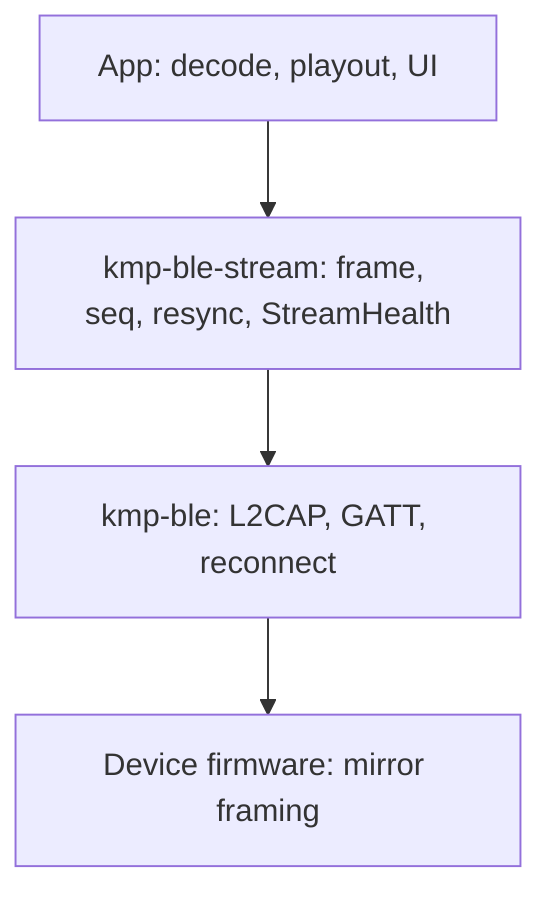
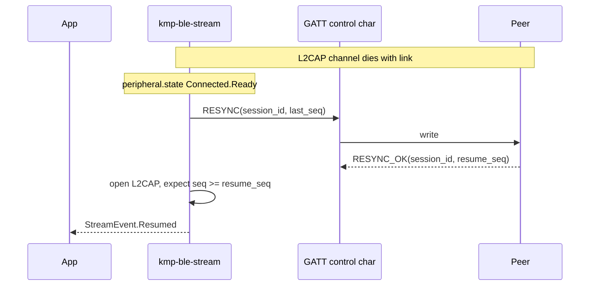

# Streaming over kmp-ble

> **Status:** Draft RFC (not implemented) | **Date:** 2026-08-27
>
> Problem analysis and a **minimal** proposed module (`kmp-ble-audio`). There is no
> `kmp-ble-audio/` package, no Kotlin implementation, and no published protocol.
> This doc exists to decide whether and how to build before writing code.

---

## Table of Contents

1. [What exists today](#1-what-exists-today)
2. [The actual gap](#2-the-actual-gap)
3. [Alternatives (read this first)](#3-alternatives-read-this-first)
4. [What we are not building](#4-what-we-are-not-building)
5. [Recommended direction](#5-recommended-direction)
6. [Draft wire format (optional, not finalized)](#6-draft-wire-format-optional-not-finalized)
7. [Resync after disconnect](#7-resync-after-disconnect)
8. [Module boundary](#8-module-boundary)
9. [Proposed API (sketch)](#9-proposed-api-sketch)
10. [Firmware and device reality](#10-firmware-and-device-reality)
11. [Background streaming](#11-background-streaming)
12. [Testing approach](#12-testing-approach)
13. [Phased plan (if we proceed)](#13-phased-plan-if-we-proceed)
14. [Decisions required before Phase 1](#14-decisions-required-before-phase-1)
15. [References](#15-references)

---

## 1. What exists today

| Asset | What it does | What it does not do |
| --- | --- | --- |
| `kmp-ble` core | GATT, L2CAP CoC, link reconnect, `ReconnectionStrategy` | Stream position, framing contract, playout, audio metrics |
| `kmp-ble-codec` | `LengthPrefixFramer`, typed CBOR over L2CAP/GATT | Raw audio blobs, stream semantics, resync |
| `BlobL2capController` (sample) | Throughput demo, length-prefix blob receive | Seq, ack, resync, jitter buffer |
| `ConnectionQualityMonitor` | Link lifecycle, RSSI | Stream throughput, gaps, buffer health |
| `IsochronousStream` (core) | LE Audio ISO shape (future) | No platform support; not a shipping path |

Jumping from `BlobL2capController` to a full custom reliable protocol would be a large leap. Any module should grow from a **narrow, justified** layer, not a greenfield TCP.

---

## 2. The actual gap

kmp-ble answers: *how do bytes cross BLE?*

Apps doing continuous audio still need answers to:

1. **Message boundaries** - `L2capChannel.incoming` emits OS-dependent chunk sizes, not logical frames.
2. **Stream continuity after reconnect** - link reconnect (`ReconnectionStrategy`, GATT cache) does not define where the audio stream resumes. A new L2CAP channel is a new byte stream.
3. **Observability** - UI wants throughput, gap rate, and buffer state. Today apps instrument this themselves (see sample stats in `BlobL2capController`).
4. **Background behavior** - iOS throttles GATT; L2CAP is better but not guaranteed. Needs measurement, not assumptions.

What is **not** automatically a library problem:

- Audio decode (AAC, SBC, Opus, PCM)
- `AVAudioSession` / `AudioTrack` lifecycle
- Jitter buffer and playout clock (app or media framework)
- Codec keyframes and PLC

---

## 3. Alternatives (read this first)

Before inventing a proprietary protocol, pick the transport that matches the product.

| Approach | When it fits | kmp-ble role | Caveats |
| --- | --- | --- | --- |
| **LE Audio (ISO)** | Hardware and stack support LE Audio | Future: `IsochronousStream` when platforms expose it | Not available for most custom peripherals today |
| **A2DP** | Classic audio headset profile | Out of scope for BLE-centric lib | Different stack; not KMP central path |
| **RFCOMM / SPP** | Legacy serial audio gadgets | Not in kmp-ble | Bluetooth Classic; platform-specific |
| **Raw L2CAP CoC** | Custom peripheral, bulk transfer, you own both ends | `L2capChannel` + app-defined framing | You must define framing and reconnect semantics |
| **GATT notify stream** | Low rate, small payloads, no L2CAP on device | `observe()` + pacing | iOS background throttle; not for high-quality music |
| **kmp-ble-codec + CBOR** | Typed sensor/events, not audio | `writeFramed` / `LengthPrefixFramer` | Wrong abstraction for audio byte blobs |
| **Custom app protocol (TCP-like)** | Rarely | Possible on top of L2CAP | Historically painful; congestion on GATT is worse |

**Recommendation:** For custom BLE peripherals in 2026, default to **raw L2CAP CoC + minimal app framing**. Add a thin kmp-ble helper module only where it removes repeated app code (reassembly, seq for metrics, resync handshake).

Do **not** default to designing "BASP" as a general Bluetooth audio protocol.

---

## 4. What we are not building

These were considered and rejected for v1 (and possibly permanently):

| Idea | Why not |
| --- | --- |
| TCP-style stack on L2CAP (ACK/NACK, sliding window, retransmit) | L2CAP CoC on an **open channel** is already reliable and in-order at the link layer. App-layer retransmit duplicates the stack without fixing reconnect (channel death). |
| Retransmit on GATT notify | iOS background throttle makes resend storms likely **certain failure**, not a "medium" risk. |
| Dual resync paths (GATT control + inline on data plane) | Race semantics undefined; stale audio for tens of seconds is unacceptable. |
| Full jitter buffer + playout clock in the library | Blurs into audio engine territory; conflicts with non-goals. |
| `StreamRole.BIDIRECTIONAL` in v1 API | Product not decided; adds credit/write paths prematurely. |
| SIG-standardized service UUID in v1 | No assigned block; protocol not proven. |
| Publishing `kmp-ble-audio` to Maven before dogfooding | Matches current monorepo policy (build from source). |

---

## 5. Recommended direction

### 5.1 Tier 0: `kmp-ble-stream` helpers (working name)

A small optional module on top of `kmp-ble` core. **Not** a full audio engine.

**L2CAP path (primary):**

- Length-prefixed **frames** with `session_id` + `seq` + payload (see draft below)
- **Reassembly** across `L2capChannel.incoming` chunks (same problem `Framer` solves; may share or mirror `kmp-ble-codec` patterns)
- **Gap detection** via `seq` (metrics + optional app callback). **No ACK/NACK/retransmit** on an open L2CAP channel unless a future benchmark proves peer corruption requires it
- **StreamHealth** `StateFlow`: receive Bps (rolling window), gap count, last seq, transport kind
- **Resync** via GATT **control characteristic only** after reconnect (see section 7)

**GATT notify path (optional, narrow):**

- Credit-based pacing (peripheral must not flood notifications)
- Seq for gap detection; **loss-tolerant only** (skip forward). **No retransmit**
- Document explicitly: not suitable for high-quality buffered music streaming

### 5.2 What stays in the app

- Codec, decode, `AudioTrack` / `AVAudioSession`
- Jitter buffer depth, underrun handling, PLC
- KEY-frame semantics (meaningless for raw PCM; only if app uses a codec)
- Baseline bitrate for "degraded" UI thresholds

### 5.3 Layer diagram



---

## 6. Draft wire format (optional, not finalized)

Placeholder name: **stream frame** (not a committed "BASP v1" spec). Firmware and app must agree out of band until this is validated on hardware.

**Per frame on the wire:**

```
[record_len: u16 LE][session_id: u16][seq: u32][flags: u8][payload...]
```

- `record_len` = bytes following (header + payload). Enables reassembly when OS splits reads.
- `session_id` - increments on new track / explicit reset. Detects stale frames after reconnect.
- `seq` - monotonic per session. Used for gap **detection**, not for L2CAP-layer retransmit.
- `flags` - v1 proposal: `EOS` bit only. Drop `KEY`/`TS` until a codec contract exists.

**Open sizing (blocks implementation):**

| Parameter | Status |
| --- | --- |
| Target bitrate (e.g. 128 kbps) | **Not chosen** |
| Frame duration (e.g. 20 ms) | **Not chosen** |
| Max payload bytes | **Derives from bitrate; not specified** |

Without these numbers, window sizes and buffer guidance in a spec would be fiction.

**Framing duplication concern:** `kmp-ble-codec` uses 4-byte length prefix for typed records. A stream module may use 2-byte prefix for small audio frames. Document the difference in one place; consider a shared `Framer` interface without forcing one prefix size.

---

## 7. Resync after disconnect

**Link reconnect != stream resume.** kmp-ble restores GATT/CCCD; it does not restore stream byte position.



Rules (draft):

- **One resync path** - GATT control only. No inline RESYNC on the data channel in v1.
- On `session_id` mismatch, fail loudly; app starts a new session or aborts.
- Ignore frames with stale `session_id` immediately (not a 30 s TTL of stale audio).
- Module **subscribes to `peripheral.state` internally** - app must not remember to call `onLinkReady()`.

---

## 8. Module boundary

Proposed package layout (if approved):

```
kmp-ble-stream/   # name TBD; "audio" only if scope stays audio-specific
  framing/        StreamFramer, reassembly
  protocol/       seq tracker, gap detection (no ack machine)
  control/        GATT resync messages
  transport/      L2capStreamTransport, optional GattNotifyTransport
  health/         StreamHealth collector
  StreamSession.kt  # app-facing facade
```

Depends on `kmp-ble` core only. **Does not** depend on `kmp-ble-codec` unless we explicitly share `Framer` types.

---

## 9. Proposed API (sketch)

Not final. Illustrates intent: thin, link-aware, no bidirectional v1.

```kotlin
class StreamSession(
    peripheral: Peripheral,
    config: StreamSessionConfig,
    scope: CoroutineScope,
) {
    val frames: Flow<StreamFrame>      // payload + sessionId + seq
    val health: StateFlow<StreamHealth>
    val events: SharedFlow<StreamEvent>

    suspend fun open()
    suspend fun close()
}

data class StreamFrame(
    val sessionId: Int,
    val seq: Long,
    val payload: ByteArray,
    val endOfStream: Boolean,
)

data class StreamHealth(
    val receiveBps: Double,
    val gapCount: Long,
    val lastSeq: Long,
    val transport: TransportKind,
    val isLinkConnected: Boolean,
)
```

**Intentionally omitted from v1:** `send()`, bidirectional role, jitter buffer, `PlayoutClock`, ACK/NACK API.

`StreamSession` owns wiring to `peripheral.state` for resync triggers.

---

## 10. Firmware and device reality

The sample app can implement a **KMP `StreamServer`** for simulation. Production peripherals almost always run **C firmware on an MCU**.

| Concern | Honest state |
| --- | --- |
| Who implements framing on device? | **Firmware team**, from a short C-friendly spec derived from section 6 |
| MCU RAM budget | Target **BASP-Lite**-style: parse header, increment seq, no ack state machine. Full TCP-like state is **out of scope** for 32 KB RAM class devices |
| Conformance | Phone-side tests against **FakeStreamTransport** first; device tests need a **reference firmware** build, not assumed |
| `AudioStreamServer` in KMP | Sample/dev only - not a stand-in for shipping hardware |

No implementation schedule should assume firmware exists until a reference device is named.

---

## 11. Background streaming

kmp-ble cannot override OS policy. See [BACKGROUND.md](BACKGROUND.md).

| Platform | Expectation |
| --- | --- |
| Android | Long-running stream needs foreground service; OEM variance is normal |
| iOS | GATT write/notify throttled in background; prefer L2CAP for data; `audio` + `bluetooth-central` background modes |

**Conformance:** A background soak test is valuable but pass criteria (gap count, throughput drop %) require **reference devices and measured baselines** - not TBD thresholds in a doc. List devices when the test exists (e.g. one iPhone generation, one Pixel).

---

## 12. Testing approach

| Layer | What |
| --- | --- |
| JVM / commonTest | `StreamFramer` fuzz (random chunk splits), seq gap detection, resync state machine with `FakeStreamTransport` |
| commonTest + `FakeL2capChannel` | End-to-end frame delivery without hardware |
| Device (optional) | Stream against reference firmware; background soak when criteria are defined |

Inherit the `BleConformanceTest` pattern only when device tests are real, not as placeholder pyramid art.

---

## 13. Phased plan (if we proceed)

Estimates assume one engineer, no major iOS L2CAP surprise. Add buffer for platform bugs.

| Phase | Scope | Exit criteria |
| --- | --- | --- |
| **0 - Decide** | Bitrate, frame size, UUIDs, firmware owner | Written agreement; section 14 cleared |
| **1 - Framing** | `StreamFramer`, draft header, JVM tests | Random chunk fuzz passes |
| **2 - Session** | `StreamSession` on L2CAP, seq + gaps, `StreamHealth` | Fake transport e2e |
| **3 - Resync** | GATT control messages, auto link subscribe | Simulated disconnect resumes at agreed seq |
| **4 - Sample** | Replace blob demo with stream demo + health UI | Manual demo on one phone + KMP server |
| **5 - GATT (optional)** | Notify + credits, loss-tolerant only | Stable rate on one device; no retransmit |
| **6 - Background** | Soak test on named devices | Documented pass/fail numbers from measurement |

**Not in initial estimate:** Maven publish, bidirectional audio, LE Audio ISO, full jitter buffer module.

---

## 14. Decisions required before Phase 1

Implementation should not start until these are answered:

| ID | Question | Owner |
| --- | --- | --- |
| D1 | Target bitrate and frame duration? | Product + firmware |
| D2 | L2CAP-only v1, or GATT fallback in v1? | Product |
| D3 | Service/characteristic UUIDs (proprietary vs vendor block)? | Firmware + app |
| D4 | Reference firmware platform (STM32, nRF, ESP32, ...)? | Hardware |
| D5 | Resync: who is source of truth for `resume_seq` (central vs peripheral)? | Protocol |
| D6 | Module name: `kmp-ble-stream` vs `kmp-ble-audio`? | Repo |
| D7 | Share `Framer` with `kmp-ble-codec` or fork 2-byte prefix? | Eng |

---

## 15. References

- [ARCHITECTURE.md](../ARCHITECTURE.md) - core transport and codec layer
- [docs/L2CAP.md](L2CAP.md) - L2CAP subsystem (OS chunk behavior)
- [docs/BACKGROUND.md](BACKGROUND.md) - platform background limits
- [docs/recovery.md](recovery.md) - link-level reconnect only
- `sample/.../BlobL2capController.kt` - throughput prototype, not a protocol
- Bluetooth Core Spec Vol 3 Part A - L2CAP CoC (link-layer reliability)

---

*End of document.*
